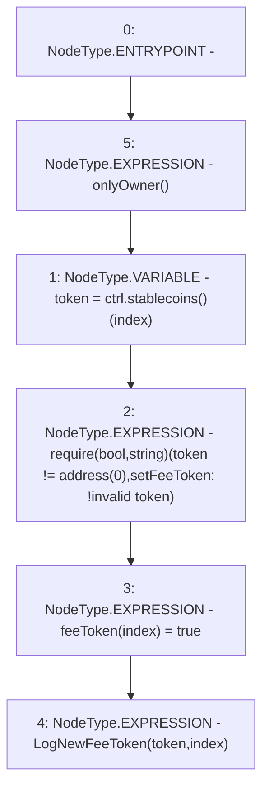

# Context: DepositHandler.setFeeToken

**Contract:** `DepositHandler` (Inherits: IDepositHandler, FixedVaults, FixedStablecoins, Constants, Controllable, Ownable, Context)
**Signature:** `setFeeToken(uint256)`
**Method Selector ID:** `0xc73af168`
**Visibility:** `external`
**Environment-Free:** `No (reads EVM state context)`
**Modifiers:**
- `onlyOwner`
  ```solidity
  modifier onlyOwner() {
          require(owner() == _msgSender(), "Ownable: caller is not the owner");
          _;
      }
  ```

### State Variables Interaction
- **Reads:** ctrl
- **Writes:** feeToken

### Assertion Checks & Business Requirements
- require/assert: `require(bool,string)(token != address(0),setFeeToken: !invalid token)`

### Environment & Verification Flags
- **Uses Foundry Cheatcodes:** No
- **Has Echidna Properties:** No

### Internal Calls Tree
- None

### External Calls / Value Transfers
- `IController.TMP_48(address[3]) = HIGH_LEVEL_CALL, dest:ctrl(IController), function:stablecoins, arguments:[]  `

### Control Flow Graph (CFG)


### Source Mapping
Declared in: `certora-ac-datasets/detasets/web3bugs/dataset/web3bugs/17/contracts/DepositHandler.sol` on lines **70** to **75**

```solidity
    function setFeeToken(uint256 index) external onlyOwner {
        address token = ctrl.stablecoins()[index];
        require(token != address(0), "setFeeToken: !invalid token");
        feeToken[index] = true;
        emit LogNewFeeToken(token, index);
    }

```
