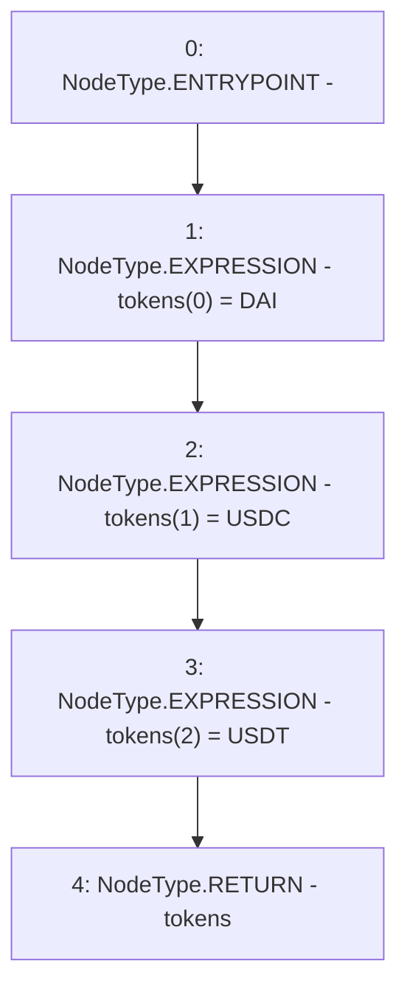

# Context: DepositHandler.underlyingTokens

**Contract:** `DepositHandler` (Inherits: IDepositHandler, FixedVaults, FixedStablecoins, Constants, Controllable, Ownable, Context)
**Signature:** `underlyingTokens() returns (address[3])`
**Method Selector ID:** `Internal (No Method ID)`
**Visibility:** `internal`
**Environment-Free:** `Yes`
**Modifiers:** None

### State Variables Interaction
- **Reads:** DAI, USDC, USDT
- **Writes:** None

### Environment & Verification Flags
- **Uses Foundry Cheatcodes:** No
- **Has Echidna Properties:** No

### Internal Calls Tree
- None

### External Calls / Value Transfers
- None

### Control Flow Graph (CFG)


### Source Mapping
Declared in: `certora-ac-datasets/detasets/web3bugs/dataset/web3bugs/17/contracts/common/FixedContracts.sol` on lines **26** to **30**

```solidity
    function underlyingTokens() internal view returns (address[N_COINS] memory tokens) {
        tokens[0] = DAI;
        tokens[1] = USDC;
        tokens[2] = USDT;
    }

```
