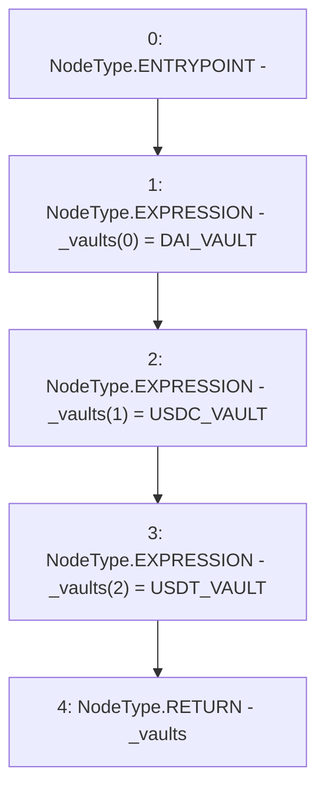

# Context: DepositHandler.vaults

**Contract:** `DepositHandler` (Inherits: IDepositHandler, FixedVaults, FixedStablecoins, Constants, Controllable, Ownable, Context)
**Signature:** `vaults() returns (address[3])`
**Method Selector ID:** `Internal (No Method ID)`
**Visibility:** `internal`
**Environment-Free:** `Yes`
**Modifiers:** None

### State Variables Interaction
- **Reads:** DAI_VAULT, USDC_VAULT, USDT_VAULT
- **Writes:** None

### Environment & Verification Flags
- **Uses Foundry Cheatcodes:** No
- **Has Echidna Properties:** No

### Internal Calls Tree
- None

### External Calls / Value Transfers
- None

### Control Flow Graph (CFG)


### Source Mapping
Declared in: `certora-ac-datasets/detasets/web3bugs/dataset/web3bugs/17/contracts/common/FixedContracts.sol` on lines **98** to **102**

```solidity
    function vaults() internal view returns (address[N_COINS] memory _vaults) {
        _vaults[0] = DAI_VAULT;
        _vaults[1] = USDC_VAULT;
        _vaults[2] = USDT_VAULT;
    }

```
