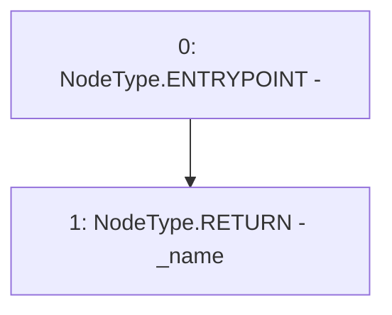

# Context: ERC20.name

**Contract:** `ERC20` (Inherits: IERC20, Context)
**Signature:** `name() returns (string)`
**Method Selector ID:** `0x06fdde03`
**Visibility:** `public`
**Environment-Free:** `Yes`
**Modifiers:** None

### State Variables Interaction
- **Reads:** _name
- **Writes:** None

### Environment & Verification Flags
- **Uses Foundry Cheatcodes:** No
- **Has Echidna Properties:** No

### Internal Calls Tree
- None

### External Calls / Value Transfers
- None

### Control Flow Graph (CFG)


### Source Mapping
Declared in: `certora-ac-datasets/detasets/web3bugs/dataset/web3bugs/17/node_modules/@openzeppelin/contracts/token/ERC20/ERC20.sol` on lines **64** to **66**

```solidity
    function name() public view virtual returns (string memory) {
        return _name;
    }

```
