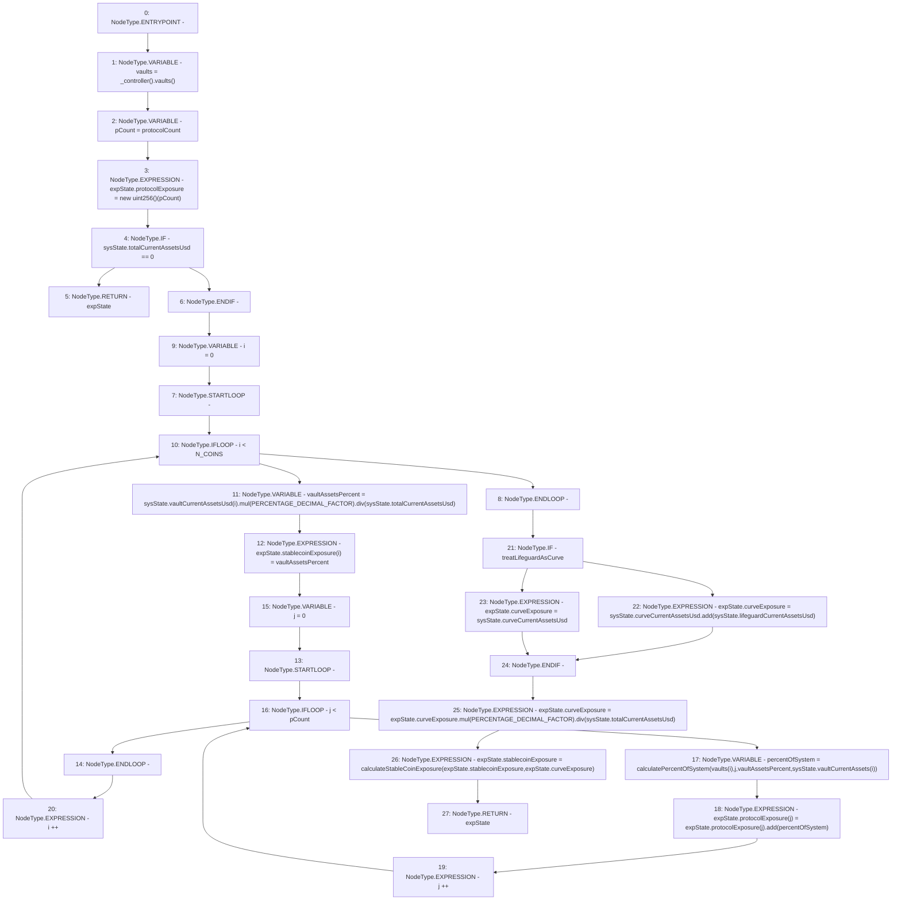

# Context: Exposure._calcRiskExposure

**Contract:** `Exposure` (Inherits: IExposure, Whitelist, Controllable, Ownable, Context, Constants)
**Signature:** `_calcRiskExposure(SystemState,bool) returns (ExposureState)`
**Method Selector ID:** `Internal (No Method ID)`
**Visibility:** `private`
**Environment-Free:** `Yes`
**Modifiers:** None

### State Variables Interaction
- **Reads:** N_COINS, PERCENTAGE_DECIMAL_FACTOR, protocolCount
- **Writes:** None

### Environment & Verification Flags
- **Uses Foundry Cheatcodes:** No
- **Has Echidna Properties:** No

### Internal Calls Tree
- None

### External Calls / Value Transfers
- `IController.TMP_194(address[3]) = HIGH_LEVEL_CALL, dest:TMP_193(IController), function:vaults, arguments:[]  `
- `SafeMath.TMP_200(uint256) = LIBRARY_CALL, dest:SafeMath, function:SafeMath.div(uint256,uint256), arguments:['TMP_199', 'REF_86'] `
- `SafeMath.TMP_199(uint256) = LIBRARY_CALL, dest:SafeMath, function:SafeMath.mul(uint256,uint256), arguments:['REF_83', 'PERCENTAGE_DECIMAL_FACTOR'] `
- `SafeMath.TMP_208(uint256) = LIBRARY_CALL, dest:SafeMath, function:SafeMath.div(uint256,uint256), arguments:['TMP_207', 'REF_107'] `
- `SafeMath.TMP_206(uint256) = LIBRARY_CALL, dest:SafeMath, function:SafeMath.add(uint256,uint256), arguments:['REF_98', 'REF_100'] `
- `SafeMath.TMP_203(uint256) = LIBRARY_CALL, dest:SafeMath, function:SafeMath.add(uint256,uint256), arguments:['REF_95', 'percentOfSystem'] `
- `SafeMath.TMP_207(uint256) = LIBRARY_CALL, dest:SafeMath, function:SafeMath.mul(uint256,uint256), arguments:['REF_104', 'PERCENTAGE_DECIMAL_FACTOR'] `

### Control Flow Graph (CFG)


### Source Mapping
Declared in: `certora-ac-datasets/detasets/web3bugs/dataset/web3bugs/17/contracts/insurance/Exposure.sol` on lines **276** to **317**

```solidity
    function _calcRiskExposure(SystemState memory sysState, bool treatLifeguardAsCurve)
        private
        view
        returns (ExposureState memory expState)
    {
        address[N_COINS] memory vaults = _controller().vaults();
        uint256 pCount = protocolCount;
        expState.protocolExposure = new uint256[](pCount);
        if (sysState.totalCurrentAssetsUsd == 0) {
            return expState;
        }
        // Stablecoin exposure
        for (uint256 i = 0; i < N_COINS; i++) {
            uint256 vaultAssetsPercent = sysState.vaultCurrentAssetsUsd[i].mul(PERCENTAGE_DECIMAL_FACTOR).div(
                sysState.totalCurrentAssetsUsd
            );
            expState.stablecoinExposure[i] = vaultAssetsPercent;
            // Protocol exposure
            for (uint256 j = 0; j < pCount; j++) {
                uint256 percentOfSystem = calculatePercentOfSystem(
                    vaults[i],
                    j,
                    vaultAssetsPercent,
                    sysState.vaultCurrentAssets[i]
                );
                expState.protocolExposure[j] = expState.protocolExposure[j].add(percentOfSystem);
            }
        }
        if (treatLifeguardAsCurve) {
            // Curve exposure is calculated by adding the Curve vaults total assets and any
            // assets in the lifeguard which are poised to be invested into the Curve vault
            expState.curveExposure = sysState.curveCurrentAssetsUsd.add(sysState.lifeguardCurrentAssetsUsd);
        } else {
            expState.curveExposure = sysState.curveCurrentAssetsUsd;
        }
        expState.curveExposure = expState.curveExposure.mul(PERCENTAGE_DECIMAL_FACTOR).div(
            sysState.totalCurrentAssetsUsd
        );

        // Calculate stablecoin exposures
        expState.stablecoinExposure = calculateStableCoinExposure(expState.stablecoinExposure, expState.curveExposure);
    }

```
