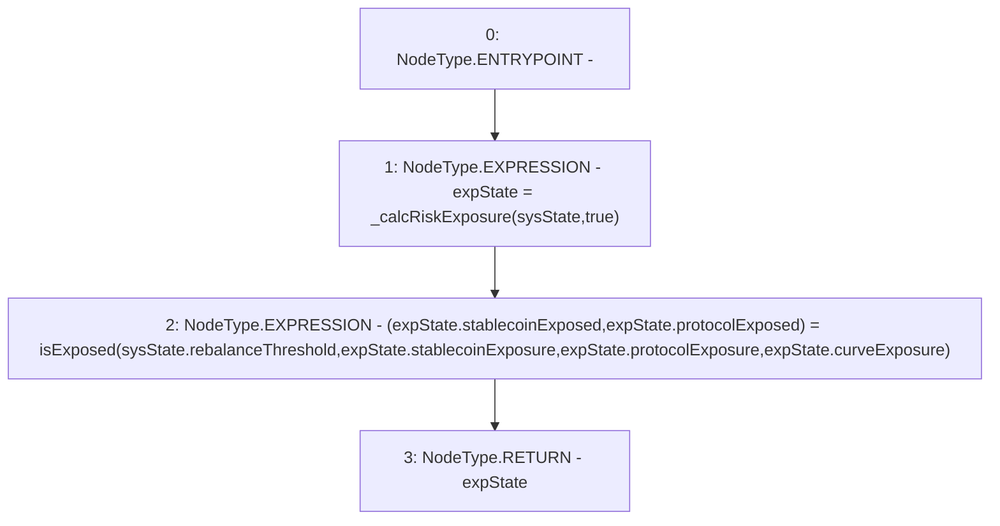

# Context: Exposure.calcRiskExposure

**Contract:** `Exposure` (Inherits: IExposure, Whitelist, Controllable, Ownable, Context, Constants)
**Signature:** `calcRiskExposure(SystemState) returns (ExposureState)`
**Method Selector ID:** `0x2b512dfc`
**Visibility:** `external`
**Environment-Free:** `Yes`
**Modifiers:** None

### State Variables Interaction
- **Reads:** None
- **Writes:** None

### Environment & Verification Flags
- **Uses Foundry Cheatcodes:** No
- **Has Echidna Properties:** No

### Internal Calls Tree
- None

### External Calls / Value Transfers
- None

### Control Flow Graph (CFG)


### Source Mapping
Declared in: `certora-ac-datasets/detasets/web3bugs/dataset/web3bugs/17/contracts/insurance/Exposure.sol` on lines **104** to **119**

```solidity
    function calcRiskExposure(SystemState calldata sysState)
        external
        view
        override
        returns (ExposureState memory expState)
    {
        expState = _calcRiskExposure(sysState, true);

        // Establish if any stablecoin/protocol is over exposed
        (expState.stablecoinExposed, expState.protocolExposed) = isExposed(
            sysState.rebalanceThreshold,
            expState.stablecoinExposure,
            expState.protocolExposure,
            expState.curveExposure
        );
    }

```
