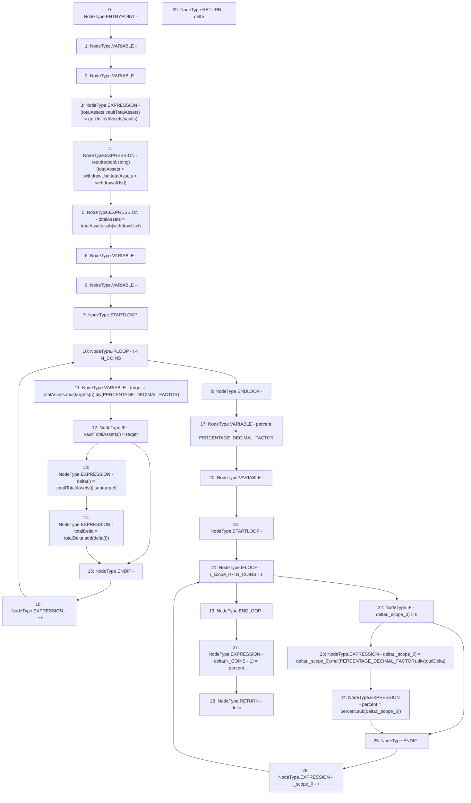

# Context: Exposure.calcRoughDelta

**Contract:** `Exposure` (Inherits: IExposure, Whitelist, Controllable, Ownable, Context, Constants)
**Signature:** `calcRoughDelta(uint256[3],address[3],uint256) returns (uint256[3])`
**Method Selector ID:** `0xfe11df06`
**Visibility:** `external`
**Environment-Free:** `Yes`
**Modifiers:** None

### State Variables Interaction
- **Reads:** N_COINS, PERCENTAGE_DECIMAL_FACTOR
- **Writes:** None

### Assertion Checks & Business Requirements
- require/assert: `require(bool,string)(totalAssets > withdrawUsd,totalAssets < withdrawalUsd)`

### Environment & Verification Flags
- **Uses Foundry Cheatcodes:** No
- **Has Echidna Properties:** No

### Internal Calls Tree
- None

### External Calls / Value Transfers
- `SafeMath.TMP_144(uint256) = LIBRARY_CALL, dest:SafeMath, function:SafeMath.sub(uint256,uint256), arguments:['totalAssets', 'withdrawUsd'] `
- `SafeMath.TMP_150(uint256) = LIBRARY_CALL, dest:SafeMath, function:SafeMath.add(uint256,uint256), arguments:['totalDelta', 'REF_46'] `
- `SafeMath.TMP_155(uint256) = LIBRARY_CALL, dest:SafeMath, function:SafeMath.mul(uint256,uint256), arguments:['REF_49', 'PERCENTAGE_DECIMAL_FACTOR'] `
- `SafeMath.TMP_156(uint256) = LIBRARY_CALL, dest:SafeMath, function:SafeMath.div(uint256,uint256), arguments:['TMP_155', 'totalDelta'] `
- `SafeMath.TMP_149(uint256) = LIBRARY_CALL, dest:SafeMath, function:SafeMath.sub(uint256,uint256), arguments:['REF_43', 'target'] `
- `SafeMath.TMP_147(uint256) = LIBRARY_CALL, dest:SafeMath, function:SafeMath.div(uint256,uint256), arguments:['TMP_146', 'PERCENTAGE_DECIMAL_FACTOR'] `
- `SafeMath.TMP_146(uint256) = LIBRARY_CALL, dest:SafeMath, function:SafeMath.mul(uint256,uint256), arguments:['totalAssets', 'REF_39'] `
- `SafeMath.TMP_157(uint256) = LIBRARY_CALL, dest:SafeMath, function:SafeMath.sub(uint256,uint256), arguments:['percent', 'REF_53'] `

### Control Flow Graph (CFG)


### Source Mapping
Declared in: `certora-ac-datasets/detasets/web3bugs/dataset/web3bugs/17/contracts/insurance/Exposure.sol` on lines **144** to **170**

```solidity
    function calcRoughDelta(
        uint256[N_COINS] calldata targets,
        address[N_COINS] calldata vaults,
        uint256 withdrawUsd
    ) external view override returns (uint256[N_COINS] memory delta) {
        (uint256 totalAssets, uint256[N_COINS] memory vaultTotalAssets) = getUnifiedAssets(vaults);

        require(totalAssets > withdrawUsd, "totalAssets < withdrawalUsd");
        totalAssets = totalAssets.sub(withdrawUsd);
        uint256 totalDelta;
        for (uint256 i; i < N_COINS; i++) {
            uint256 target = totalAssets.mul(targets[i]).div(PERCENTAGE_DECIMAL_FACTOR);
            if (vaultTotalAssets[i] > target) {
                delta[i] = vaultTotalAssets[i].sub(target);
                totalDelta = totalDelta.add(delta[i]);
            }
        }
        uint256 percent = PERCENTAGE_DECIMAL_FACTOR;
        for (uint256 i; i < N_COINS - 1; i++) {
            if (delta[i] > 0) {
                delta[i] = delta[i].mul(PERCENTAGE_DECIMAL_FACTOR).div(totalDelta);
                percent = percent.sub(delta[i]);
            }
        }
        delta[N_COINS - 1] = percent;
        return delta;
    }

```
