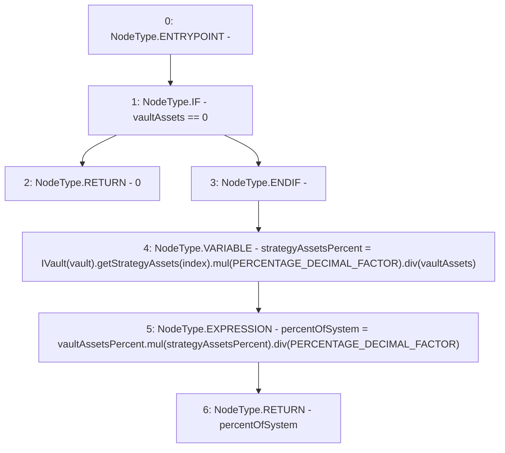

# Context: Exposure.calculatePercentOfSystem

**Contract:** `Exposure` (Inherits: IExposure, Whitelist, Controllable, Ownable, Context, Constants)
**Signature:** `calculatePercentOfSystem(address,uint256,uint256,uint256) returns (uint256)`
**Method Selector ID:** `Internal (No Method ID)`
**Visibility:** `private`
**Environment-Free:** `Yes`
**Modifiers:** None

### State Variables Interaction
- **Reads:** PERCENTAGE_DECIMAL_FACTOR
- **Writes:** None

### Environment & Verification Flags
- **Uses Foundry Cheatcodes:** No
- **Has Echidna Properties:** No

### Internal Calls Tree
- None

### External Calls / Value Transfers
- `SafeMath.TMP_173(uint256) = LIBRARY_CALL, dest:SafeMath, function:SafeMath.mul(uint256,uint256), arguments:['TMP_172', 'PERCENTAGE_DECIMAL_FACTOR'] `
- `SafeMath.TMP_175(uint256) = LIBRARY_CALL, dest:SafeMath, function:SafeMath.mul(uint256,uint256), arguments:['vaultAssetsPercent', 'strategyAssetsPercent'] `
- `IVault.TMP_172(uint256) = HIGH_LEVEL_CALL, dest:TMP_171(IVault), function:getStrategyAssets, arguments:['index']  `
- `SafeMath.TMP_176(uint256) = LIBRARY_CALL, dest:SafeMath, function:SafeMath.div(uint256,uint256), arguments:['TMP_175', 'PERCENTAGE_DECIMAL_FACTOR'] `
- `SafeMath.TMP_174(uint256) = LIBRARY_CALL, dest:SafeMath, function:SafeMath.div(uint256,uint256), arguments:['TMP_173', 'vaultAssets'] `

### Control Flow Graph (CFG)


### Source Mapping
Declared in: `certora-ac-datasets/detasets/web3bugs/dataset/web3bugs/17/contracts/insurance/Exposure.sol` on lines **217** to **229**

```solidity
    function calculatePercentOfSystem(
        address vault,
        uint256 index,
        uint256 vaultAssetsPercent,
        uint256 vaultAssets
    ) private view returns (uint256 percentOfSystem) {
        if (vaultAssets == 0) return 0;
        uint256 strategyAssetsPercent = IVault(vault).getStrategyAssets(index).mul(PERCENTAGE_DECIMAL_FACTOR).div(
            vaultAssets
        );

        percentOfSystem = vaultAssetsPercent.mul(strategyAssetsPercent).div(PERCENTAGE_DECIMAL_FACTOR);
    }

```
