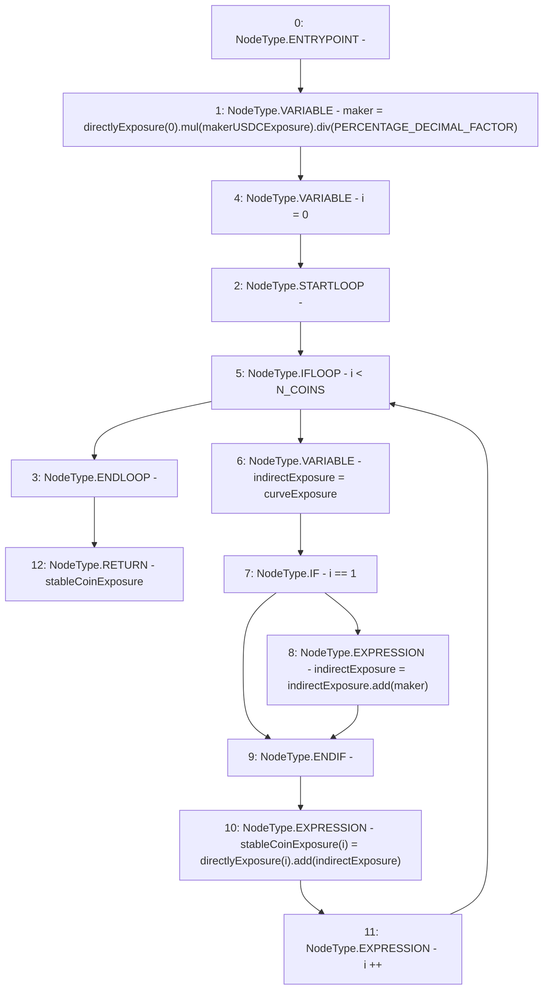

# Context: Exposure.calculateStableCoinExposure

**Contract:** `Exposure` (Inherits: IExposure, Whitelist, Controllable, Ownable, Context, Constants)
**Signature:** `calculateStableCoinExposure(uint256[3],uint256) returns (uint256[3])`
**Method Selector ID:** `Internal (No Method ID)`
**Visibility:** `private`
**Environment-Free:** `Yes`
**Modifiers:** None

### State Variables Interaction
- **Reads:** N_COINS, PERCENTAGE_DECIMAL_FACTOR, makerUSDCExposure
- **Writes:** None

### Environment & Verification Flags
- **Uses Foundry Cheatcodes:** No
- **Has Echidna Properties:** No

### Internal Calls Tree
- None

### External Calls / Value Transfers
- `SafeMath.TMP_178(uint256) = LIBRARY_CALL, dest:SafeMath, function:SafeMath.div(uint256,uint256), arguments:['TMP_177', 'PERCENTAGE_DECIMAL_FACTOR'] `
- `SafeMath.TMP_182(uint256) = LIBRARY_CALL, dest:SafeMath, function:SafeMath.add(uint256,uint256), arguments:['REF_74', 'indirectExposure'] `
- `SafeMath.TMP_177(uint256) = LIBRARY_CALL, dest:SafeMath, function:SafeMath.mul(uint256,uint256), arguments:['REF_69', 'makerUSDCExposure'] `
- `SafeMath.TMP_181(uint256) = LIBRARY_CALL, dest:SafeMath, function:SafeMath.add(uint256,uint256), arguments:['indirectExposure', 'maker'] `

### Control Flow Graph (CFG)


### Source Mapping
Declared in: `certora-ac-datasets/detasets/web3bugs/dataset/web3bugs/17/contracts/insurance/Exposure.sol` on lines **234** to **247**

```solidity
    function calculateStableCoinExposure(uint256[N_COINS] memory directlyExposure, uint256 curveExposure)
        private
        view
        returns (uint256[N_COINS] memory stableCoinExposure)
    {
        uint256 maker = directlyExposure[0].mul(makerUSDCExposure).div(PERCENTAGE_DECIMAL_FACTOR);
        for (uint256 i = 0; i < N_COINS; i++) {
            uint256 indirectExposure = curveExposure;
            if (i == 1) {
                indirectExposure = indirectExposure.add(maker);
            }
            stableCoinExposure[i] = directlyExposure[i].add(indirectExposure);
        }
    }

```
