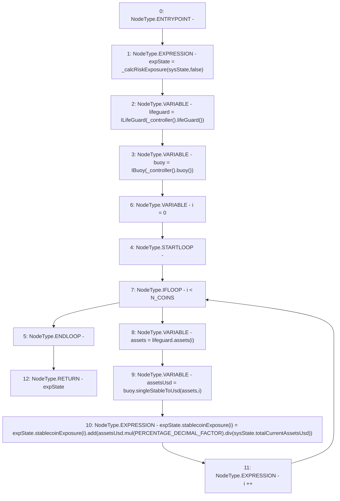

# Context: Exposure.getExactRiskExposure

**Contract:** `Exposure` (Inherits: IExposure, Whitelist, Controllable, Ownable, Context, Constants)
**Signature:** `getExactRiskExposure(SystemState) returns (ExposureState)`
**Method Selector ID:** `0x700a63f9`
**Visibility:** `external`
**Environment-Free:** `Yes`
**Modifiers:** None

### State Variables Interaction
- **Reads:** N_COINS, PERCENTAGE_DECIMAL_FACTOR
- **Writes:** None

### Environment & Verification Flags
- **Uses Foundry Cheatcodes:** No
- **Has Echidna Properties:** No

### Internal Calls Tree
- None

### External Calls / Value Transfers
- `IController.TMP_116(address) = HIGH_LEVEL_CALL, dest:TMP_115(IController), function:lifeGuard, arguments:[]  `
- `IBuoy.TMP_123(uint256) = HIGH_LEVEL_CALL, dest:buoy(IBuoy), function:singleStableToUsd, arguments:['assets', 'i']  `
- `IController.TMP_119(address) = HIGH_LEVEL_CALL, dest:TMP_118(IController), function:buoy, arguments:[]  `
- `SafeMath.TMP_125(uint256) = LIBRARY_CALL, dest:SafeMath, function:SafeMath.div(uint256,uint256), arguments:['TMP_124', 'REF_20'] `
- `SafeMath.TMP_126(uint256) = LIBRARY_CALL, dest:SafeMath, function:SafeMath.add(uint256,uint256), arguments:['REF_16', 'TMP_125'] `
- `SafeMath.TMP_124(uint256) = LIBRARY_CALL, dest:SafeMath, function:SafeMath.mul(uint256,uint256), arguments:['assetsUsd', 'PERCENTAGE_DECIMAL_FACTOR'] `
- `ILifeGuard.TMP_122(uint256) = HIGH_LEVEL_CALL, dest:lifeguard(ILifeGuard), function:assets, arguments:['i']  `

### Control Flow Graph (CFG)


### Source Mapping
Declared in: `certora-ac-datasets/detasets/web3bugs/dataset/web3bugs/17/contracts/insurance/Exposure.sol` on lines **79** to **95**

```solidity
    function getExactRiskExposure(SystemState calldata sysState)
        external
        view
        override
        returns (ExposureState memory expState)
    {
        expState = _calcRiskExposure(sysState, false);
        ILifeGuard lifeguard = ILifeGuard(_controller().lifeGuard());
        IBuoy buoy = IBuoy(_controller().buoy());
        for (uint256 i = 0; i < N_COINS; i++) {
            uint256 assets = lifeguard.assets(i);
            uint256 assetsUsd = buoy.singleStableToUsd(assets, i);
            expState.stablecoinExposure[i] = expState.stablecoinExposure[i].add(
                assetsUsd.mul(PERCENTAGE_DECIMAL_FACTOR).div(sysState.totalCurrentAssetsUsd)
            );
        }
    }

```
