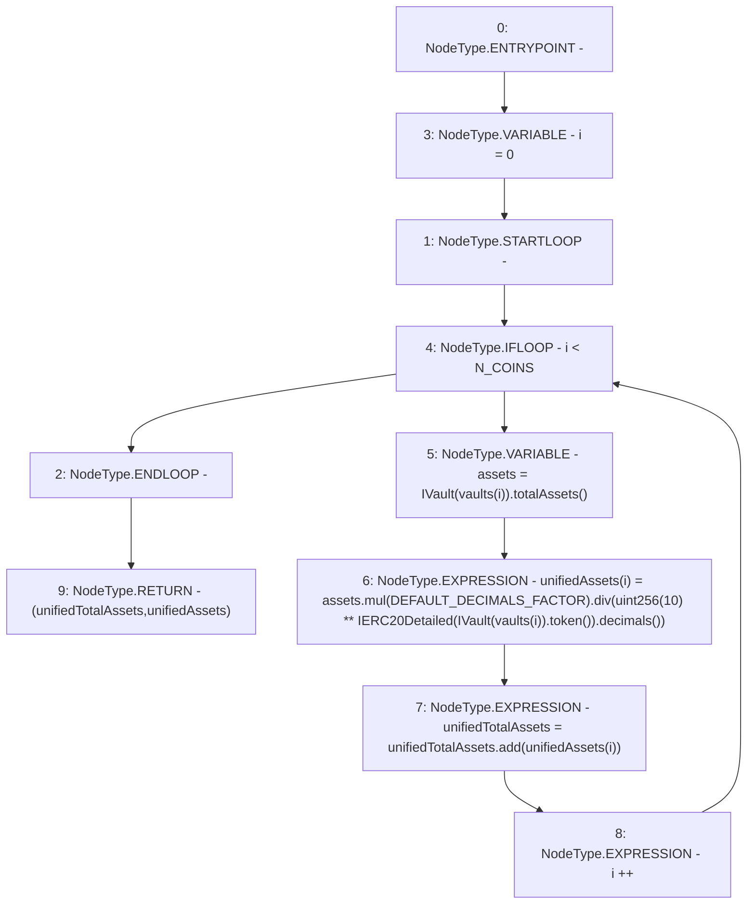

# Context: Exposure.getUnifiedAssets

**Contract:** `Exposure` (Inherits: IExposure, Whitelist, Controllable, Ownable, Context, Constants)
**Signature:** `getUnifiedAssets(address[3]) returns (uint256, uint256[3])`
**Method Selector ID:** `0xc1106979`
**Visibility:** `public`
**Environment-Free:** `Yes`
**Modifiers:** None

### State Variables Interaction
- **Reads:** DEFAULT_DECIMALS_FACTOR, N_COINS
- **Writes:** None

### Environment & Verification Flags
- **Uses Foundry Cheatcodes:** No
- **Has Echidna Properties:** No

### Internal Calls Tree
- None

### External Calls / Value Transfers
- `SafeMath.TMP_132(uint256) = LIBRARY_CALL, dest:SafeMath, function:SafeMath.mul(uint256,uint256), arguments:['assets', 'DEFAULT_DECIMALS_FACTOR'] `
- `SafeMath.TMP_140(uint256) = LIBRARY_CALL, dest:SafeMath, function:SafeMath.add(uint256,uint256), arguments:['unifiedTotalAssets', 'REF_36'] `
- `IVault.TMP_135(address) = HIGH_LEVEL_CALL, dest:TMP_134(IVault), function:token, arguments:[]  `
- `IVault.TMP_131(uint256) = HIGH_LEVEL_CALL, dest:TMP_130(IVault), function:totalAssets, arguments:[]  `
- `SafeMath.TMP_139(uint256) = LIBRARY_CALL, dest:SafeMath, function:SafeMath.div(uint256,uint256), arguments:['TMP_132', 'TMP_138'] `
- `IERC20Detailed.TMP_137(uint8) = HIGH_LEVEL_CALL, dest:TMP_136(IERC20Detailed), function:decimals, arguments:[]  `

### Control Flow Graph (CFG)


### Source Mapping
Declared in: `certora-ac-datasets/detasets/web3bugs/dataset/web3bugs/17/contracts/insurance/Exposure.sol` on lines **123** to **137**

```solidity
    function getUnifiedAssets(address[N_COINS] calldata vaults)
        public
        view
        override
        returns (uint256 unifiedTotalAssets, uint256[N_COINS] memory unifiedAssets)
    {
        // unify all assets to 18 decimals, treat each stablecoin as being worth 1 USD
        for (uint256 i = 0; i < N_COINS; i++) {
            uint256 assets = IVault(vaults[i]).totalAssets();
            unifiedAssets[i] = assets.mul(DEFAULT_DECIMALS_FACTOR).div(
                uint256(10)**IERC20Detailed(IVault(vaults[i]).token()).decimals()
            );
            unifiedTotalAssets = unifiedTotalAssets.add(unifiedAssets[i]);
        }
    }

```
