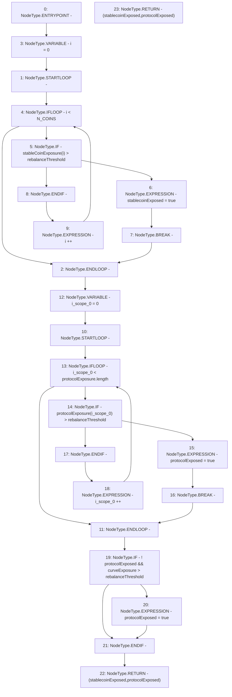

# Context: Exposure.isExposed

**Contract:** `Exposure` (Inherits: IExposure, Whitelist, Controllable, Ownable, Context, Constants)
**Signature:** `isExposed(uint256,uint256[3],uint256[],uint256) returns (bool, bool)`
**Method Selector ID:** `Internal (No Method ID)`
**Visibility:** `private`
**Environment-Free:** `Yes`
**Modifiers:** None

### State Variables Interaction
- **Reads:** N_COINS
- **Writes:** None

### Environment & Verification Flags
- **Uses Foundry Cheatcodes:** No
- **Has Echidna Properties:** No

### Internal Calls Tree
- None

### External Calls / Value Transfers
- None

### Control Flow Graph (CFG)


### Source Mapping
Declared in: `certora-ac-datasets/detasets/web3bugs/dataset/web3bugs/17/contracts/insurance/Exposure.sol` on lines **254** to **274**

```solidity
    function isExposed(
        uint256 rebalanceThreshold,
        uint256[N_COINS] memory stableCoinExposure,
        uint256[] memory protocolExposure,
        uint256 curveExposure
    ) private pure returns (bool stablecoinExposed, bool protocolExposed) {
        for (uint256 i = 0; i < N_COINS; i++) {
            if (stableCoinExposure[i] > rebalanceThreshold) {
                stablecoinExposed = true;
                break;
            }
        }
        for (uint256 i = 0; i < protocolExposure.length; i++) {
            if (protocolExposure[i] > rebalanceThreshold) {
                protocolExposed = true;
                break;
            }
        }
        if (!protocolExposed && curveExposure > rebalanceThreshold) protocolExposed = true;
        return (stablecoinExposed, protocolExposed);
    }

```
