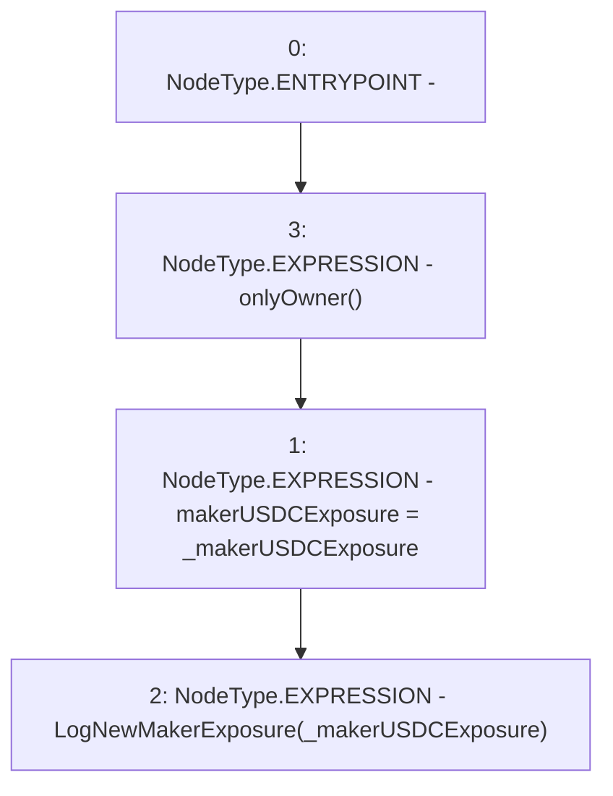

# Context: Exposure.setMakerUSDCExposure

**Contract:** `Exposure` (Inherits: IExposure, Whitelist, Controllable, Ownable, Context, Constants)
**Signature:** `setMakerUSDCExposure(uint256)`
**Method Selector ID:** `0x104177ae`
**Visibility:** `external`
**Environment-Free:** `No (reads EVM state context)`
**Modifiers:**
- `onlyOwner`
  ```solidity
  modifier onlyOwner() {
          require(owner() == _msgSender(), "Ownable: caller is not the owner");
          _;
      }
  ```

### State Variables Interaction
- **Reads:** None
- **Writes:** makerUSDCExposure

### Environment & Verification Flags
- **Uses Foundry Cheatcodes:** No
- **Has Echidna Properties:** No

### Internal Calls Tree
- None

### External Calls / Value Transfers
- None

### Control Flow Graph (CFG)


### Source Mapping
Declared in: `certora-ac-datasets/detasets/web3bugs/dataset/web3bugs/17/contracts/insurance/Exposure.sol` on lines **74** to **77**

```solidity
    function setMakerUSDCExposure(uint256 _makerUSDCExposure) external onlyOwner {
        makerUSDCExposure = _makerUSDCExposure;
        emit LogNewMakerExposure(_makerUSDCExposure);
    }

```
