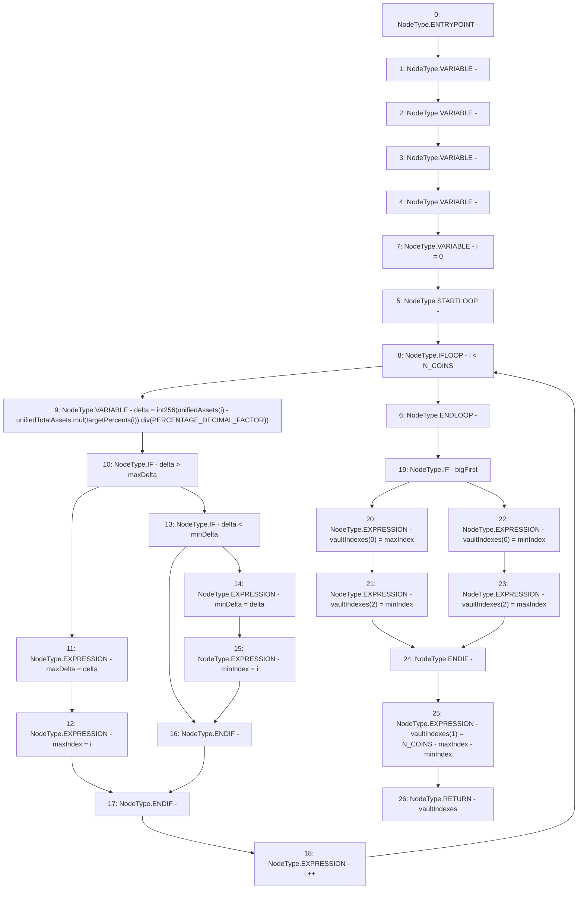

# Context: Exposure.sortVaultsByDelta

**Contract:** `Exposure` (Inherits: IExposure, Whitelist, Controllable, Ownable, Context, Constants)
**Signature:** `sortVaultsByDelta(bool,uint256,uint256[3],uint256[3]) returns (uint256[3])`
**Method Selector ID:** `0x72ea0acc`
**Visibility:** `external`
**Environment-Free:** `Yes`
**Modifiers:** None

### State Variables Interaction
- **Reads:** N_COINS, PERCENTAGE_DECIMAL_FACTOR
- **Writes:** None

### Environment & Verification Flags
- **Uses Foundry Cheatcodes:** No
- **Has Echidna Properties:** No

### Internal Calls Tree
- None

### External Calls / Value Transfers
- `SafeMath.TMP_161(uint256) = LIBRARY_CALL, dest:SafeMath, function:SafeMath.mul(uint256,uint256), arguments:['unifiedTotalAssets', 'REF_57'] `
- `SafeMath.TMP_162(uint256) = LIBRARY_CALL, dest:SafeMath, function:SafeMath.div(uint256,uint256), arguments:['TMP_161', 'PERCENTAGE_DECIMAL_FACTOR'] `

### Control Flow Graph (CFG)


### Source Mapping
Declared in: `certora-ac-datasets/detasets/web3bugs/dataset/web3bugs/17/contracts/insurance/Exposure.sol` on lines **178** to **210**

```solidity
    function sortVaultsByDelta(
        bool bigFirst,
        uint256 unifiedTotalAssets,
        uint256[N_COINS] calldata unifiedAssets,
        uint256[N_COINS] calldata targetPercents
    ) external pure override returns (uint256[N_COINS] memory vaultIndexes) {
        uint256 maxIndex;
        uint256 minIndex;
        int256 maxDelta;
        int256 minDelta;
        for (uint256 i = 0; i < N_COINS; i++) {
            // Get difference between vault current assets and vault target
            int256 delta = int256(
                unifiedAssets[i] - unifiedTotalAssets.mul(targetPercents[i]).div(PERCENTAGE_DECIMAL_FACTOR)
            );
            // Establish order
            if (delta > maxDelta) {
                maxDelta = delta;
                maxIndex = i;
            } else if (delta < minDelta) {
                minDelta = delta;
                minIndex = i;
            }
        }
        if (bigFirst) {
            vaultIndexes[0] = maxIndex;
            vaultIndexes[2] = minIndex;
        } else {
            vaultIndexes[0] = minIndex;
            vaultIndexes[2] = maxIndex;
        }
        vaultIndexes[1] = N_COINS - maxIndex - minIndex;
    }

```
