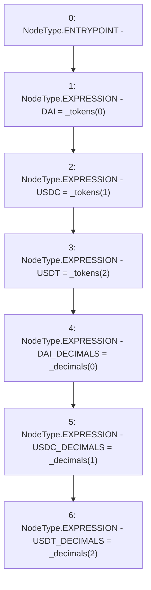

# Context: FixedStablecoins.constructor

**Contract:** `FixedStablecoins` (Inherits: Constants)
**Signature:** `constructor(address[3],uint256[3])`
**Method Selector ID:** `0x7768118f`
**Visibility:** `public`
**Environment-Free:** `Yes`
**Modifiers:** None

### State Variables Interaction
- **Reads:** None
- **Writes:** DAI, DAI_DECIMALS, USDC, USDC_DECIMALS, USDT, USDT_DECIMALS

### Environment & Verification Flags
- **Uses Foundry Cheatcodes:** No
- **Has Echidna Properties:** No

### Internal Calls Tree
- None

### External Calls / Value Transfers
- None

### Control Flow Graph (CFG)


### Source Mapping
Declared in: `certora-ac-datasets/detasets/web3bugs/dataset/web3bugs/17/contracts/common/FixedContracts.sol` on lines **17** to **24**

```solidity
    constructor(address[N_COINS] memory _tokens, uint256[N_COINS] memory _decimals) public {
        DAI = _tokens[0];
        USDC = _tokens[1];
        USDT = _tokens[2];
        DAI_DECIMALS = _decimals[0];
        USDC_DECIMALS = _decimals[1];
        USDT_DECIMALS = _decimals[2];
    }

```
