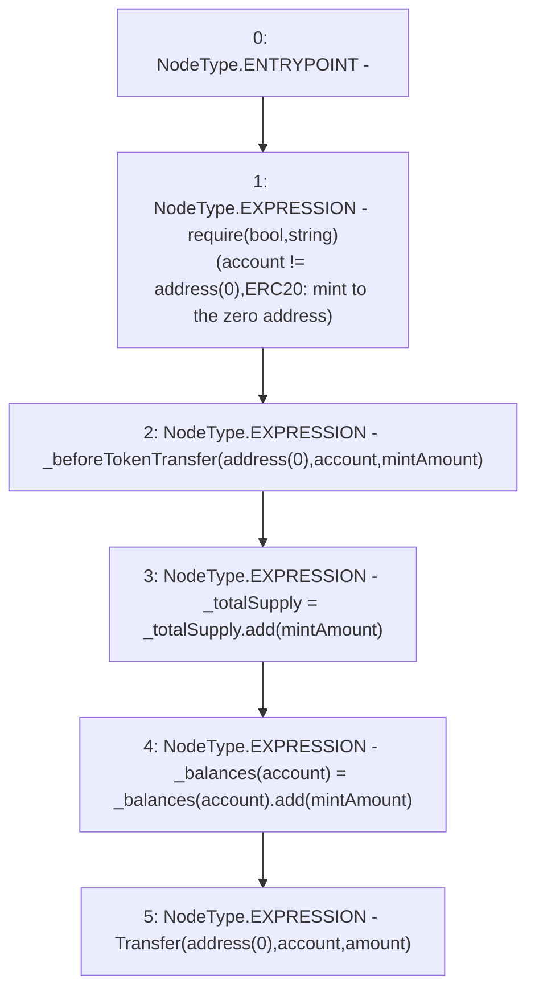

# Context: GToken._mint

**Contract:** `GToken` (Inherits: IToken, Whitelist, Ownable, Constants, GERC20, IERC20, Context)
**Signature:** `_mint(address,uint256,uint256)`
**Method Selector ID:** `Internal (No Method ID)`
**Visibility:** `internal`
**Environment-Free:** `Yes`
**Modifiers:** None

### State Variables Interaction
- **Reads:** _balances, _totalSupply
- **Writes:** _balances, _totalSupply

### Assertion Checks & Business Requirements
- require/assert: `require(bool,string)(account != address(0),ERC20: mint to the zero address)`

### Environment & Verification Flags
- **Uses Foundry Cheatcodes:** No
- **Has Echidna Properties:** No

### Internal Calls Tree
- None

### External Calls / Value Transfers
- `SafeMath.TMP_149(uint256) = LIBRARY_CALL, dest:SafeMath, function:SafeMath.add(uint256,uint256), arguments:['_totalSupply', 'mintAmount'] `
- `SafeMath.TMP_150(uint256) = LIBRARY_CALL, dest:SafeMath, function:SafeMath.add(uint256,uint256), arguments:['REF_60', 'mintAmount'] `

### Control Flow Graph (CFG)


### Source Mapping
Declared in: `certora-ac-datasets/detasets/web3bugs/dataset/web3bugs/17/contracts/tokens/GERC20.sol` on lines **251** to **263**

```solidity
    function _mint(
        address account,
        uint256 mintAmount,
        uint256 amount
    ) internal virtual {
        require(account != address(0), "ERC20: mint to the zero address");

        _beforeTokenTransfer(address(0), account, mintAmount);

        _totalSupply = _totalSupply.add(mintAmount);
        _balances[account] = _balances[account].add(mintAmount);
        emit Transfer(address(0), account, amount);
    }

```
