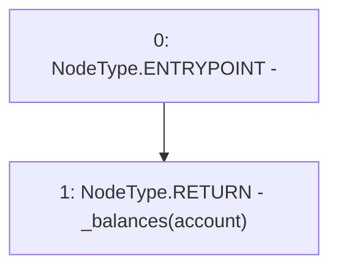

# Context: GToken.balanceOfBase

**Contract:** `GToken` (Inherits: IToken, Whitelist, Ownable, Constants, GERC20, IERC20, Context)
**Signature:** `balanceOfBase(address) returns (uint256)`
**Method Selector ID:** `0x0c8066bc`
**Visibility:** `public`
**Environment-Free:** `Yes`
**Modifiers:** None

### State Variables Interaction
- **Reads:** _balances
- **Writes:** None

### Environment & Verification Flags
- **Uses Foundry Cheatcodes:** No
- **Has Echidna Properties:** No

### Internal Calls Tree
- None

### External Calls / Value Transfers
- None

### Control Flow Graph (CFG)


### Source Mapping
Declared in: `certora-ac-datasets/detasets/web3bugs/dataset/web3bugs/17/contracts/tokens/GERC20.sol` on lines **109** to **111**

```solidity
    function balanceOfBase(address account) public view returns (uint256) {
        return _balances[account];
    }

```
