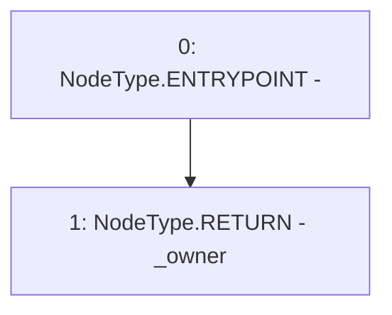

# Context: GToken.owner

**Contract:** `GToken` (Inherits: IToken, Whitelist, Ownable, Constants, GERC20, IERC20, Context)
**Signature:** `owner() returns (address)`
**Method Selector ID:** `0x8da5cb5b`
**Visibility:** `public`
**Environment-Free:** `Yes`
**Modifiers:** None

### State Variables Interaction
- **Reads:** _owner
- **Writes:** None

### Environment & Verification Flags
- **Uses Foundry Cheatcodes:** No
- **Has Echidna Properties:** No

### Internal Calls Tree
- None

### External Calls / Value Transfers
- None

### Control Flow Graph (CFG)


### Source Mapping
Declared in: `certora-ac-datasets/detasets/web3bugs/dataset/web3bugs/17/node_modules/@openzeppelin/contracts/access/Ownable.sol` on lines **35** to **37**

```solidity
    function owner() public view virtual returns (address) {
        return _owner;
    }

```
