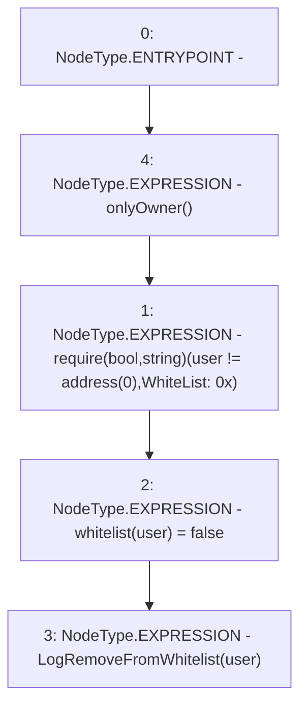

# Context: GToken.removeFromWhitelist

**Contract:** `GToken` (Inherits: IToken, Whitelist, Ownable, Constants, GERC20, IERC20, Context)
**Signature:** `removeFromWhitelist(address)`
**Method Selector ID:** `0x8ab1d681`
**Visibility:** `external`
**Environment-Free:** `No (reads EVM state context)`
**Modifiers:**
- `onlyOwner`
  ```solidity
  modifier onlyOwner() {
          require(owner() == _msgSender(), "Ownable: caller is not the owner");
          _;
      }
  ```

### State Variables Interaction
- **Reads:** None
- **Writes:** whitelist

### Assertion Checks & Business Requirements
- require/assert: `require(bool,string)(user != address(0),WhiteList: 0x)`

### Environment & Verification Flags
- **Uses Foundry Cheatcodes:** No
- **Has Echidna Properties:** No

### Internal Calls Tree
- None

### External Calls / Value Transfers
- None

### Control Flow Graph (CFG)


### Source Mapping
Declared in: `certora-ac-datasets/detasets/web3bugs/dataset/web3bugs/17/contracts/common/Whitelist.sol` on lines **23** to **27**

```solidity
    function removeFromWhitelist(address user) external onlyOwner {
        require(user != address(0), "WhiteList: 0x");
        whitelist[user] = false;
        emit LogRemoveFromWhitelist(user);
    }

```
