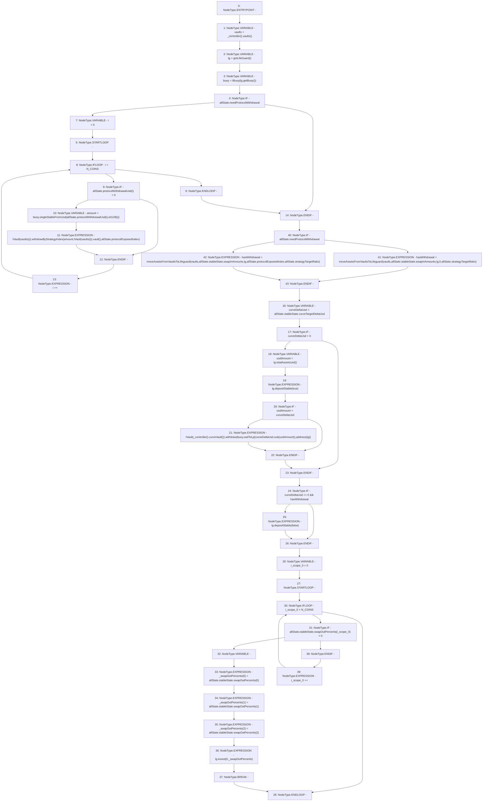

# Context: Insurance._rebalance

**Contract:** `Insurance` (Inherits: IInsurance, Whitelist, Controllable, Ownable, Context, Constants)
**Signature:** `_rebalance(AllocationState)`
**Method Selector ID:** `Internal (No Method ID)`
**Visibility:** `private`
**Environment-Free:** `Yes`
**Modifiers:** None

### State Variables Interaction
- **Reads:** N_COINS
- **Writes:** None

### Environment & Verification Flags
- **Uses Foundry Cheatcodes:** No
- **Has Echidna Properties:** No

### Internal Calls Tree
- None

### External Calls / Value Transfers
- `ILifeGuard.TMP_307(uint256) = HIGH_LEVEL_CALL, dest:lg(ILifeGuard), function:depositStable, arguments:['True']  `
- `ILifeGuard.TMP_294(address) = HIGH_LEVEL_CALL, dest:lg(ILifeGuard), function:getBuoy, arguments:[]  `
- `ILifeGuard.TMP_318(uint256) = HIGH_LEVEL_CALL, dest:lg(ILifeGuard), function:depositStable, arguments:['False']  `
- `ILifeGuard.TMP_321(uint256) = HIGH_LEVEL_CALL, dest:lg(ILifeGuard), function:invest, arguments:['0', '_swapOutPercents']  `
- `IController.TMP_310(address) = HIGH_LEVEL_CALL, dest:TMP_309(IController), function:curveVault, arguments:[]  `
- `SafeMath.TMP_312(uint256) = LIBRARY_CALL, dest:SafeMath, function:SafeMath.sub(uint256,uint256), arguments:['curveDeltaUsd', 'usdAmount'] `
- `IVault.HIGH_LEVEL_CALL, dest:TMP_300(IVault), function:withdrawByStrategyIndex, arguments:['amount', 'TMP_302', 'REF_152']  `
- `IController.TMP_292(address[3]) = HIGH_LEVEL_CALL, dest:TMP_291(IController), function:vaults, arguments:[]  `
- `IBuoy.TMP_313(uint256) = HIGH_LEVEL_CALL, dest:buoy(IBuoy), function:usdToLp, arguments:['TMP_312']  `
- `ILifeGuard.TMP_306(uint256) = HIGH_LEVEL_CALL, dest:lg(ILifeGuard), function:totalAssetsUsd, arguments:[]  `
- `IVault.HIGH_LEVEL_CALL, dest:TMP_311(IVault), function:withdraw, arguments:['TMP_313', 'TMP_314']  `
- `IVault.TMP_302(address) = HIGH_LEVEL_CALL, dest:TMP_301(IVault), function:vault, arguments:[]  `
- `IBuoy.TMP_299(uint256) = HIGH_LEVEL_CALL, dest:buoy(IBuoy), function:singleStableFromUsd, arguments:['REF_147', 'TMP_298']  `

### Control Flow Graph (CFG)


### Source Mapping
Declared in: `certora-ac-datasets/detasets/web3bugs/dataset/web3bugs/17/contracts/insurance/Insurance.sol` on lines **443** to **499**

```solidity
    function _rebalance(AllocationState memory allState) private {
        address[N_COINS] memory vaults = _controller().vaults();
        ILifeGuard lg = getLifeGuard();
        IBuoy buoy = IBuoy(lg.getBuoy());
        // Withdraw from strategies that are overexposed
        if (allState.needProtocolWithdrawal) {
            for (uint256 i = 0; i < N_COINS; i++) {
                if (allState.protocolWithdrawalUsd[i] > 0) {
                    uint256 amount = buoy.singleStableFromUsd(allState.protocolWithdrawalUsd[i], int128(i));
                    IVault(vaults[i]).withdrawByStrategyIndex(
                        amount,
                        IVault(vaults[i]).vault(),
                        allState.protocolExposedIndex
                    );
                }
            }
        }

        bool hasWithdrawal = moveAssetsFromVaultsToLifeguard(
            vaults,
            allState.stableState.swapInAmounts,
            lg,
            allState.needProtocolWithdrawal ? 0 : allState.protocolExposedIndex,
            allState.strategyTargetRatio // Only adjust strategy ratio here
        );

        // Withdraw from Curve vault
        uint256 curveDeltaUsd = allState.stableState.curveTargetDeltaUsd;
        if (curveDeltaUsd > 0) {
            uint256 usdAmount = lg.totalAssetsUsd();
            // This step moves all lifeguard assets into swap out stablecoin vaults, it might cause
            // protocol over exposure in some edge cases after invest/harvest. But it won't have a
            // large impact on the system, as investToCurve should be run periodically by external actors,
            // minimising the total amount of assets in the lifeguard.
            //   - Its recommended to check the total assets in the lifeguard and run the invest to curve
            //   trigger() to determine if investToCurve needs to be run manually before rebalance
            lg.depositStable(true);
            if (usdAmount < curveDeltaUsd) {
                IVault(_controller().curveVault()).withdraw(buoy.usdToLp(curveDeltaUsd.sub(usdAmount)), address(lg));
            }
        }

        if (curveDeltaUsd == 0 && hasWithdrawal) lg.depositStable(false);

        // Keep buffer asset in lifeguard and convert the rest of the assets to target stablecoin.
        // If swapOutPercent all are zero, don't run prepareInvestment
        for (uint256 i = 0; i < N_COINS; i++) {
            if (allState.stableState.swapOutPercents[i] > 0) {
                uint256[N_COINS] memory _swapOutPercents;
                _swapOutPercents[0] = allState.stableState.swapOutPercents[0];
                _swapOutPercents[1] = allState.stableState.swapOutPercents[1];
                _swapOutPercents[2] = allState.stableState.swapOutPercents[2];
                lg.invest(0, _swapOutPercents);
                break;
            }
        }
    }

```
