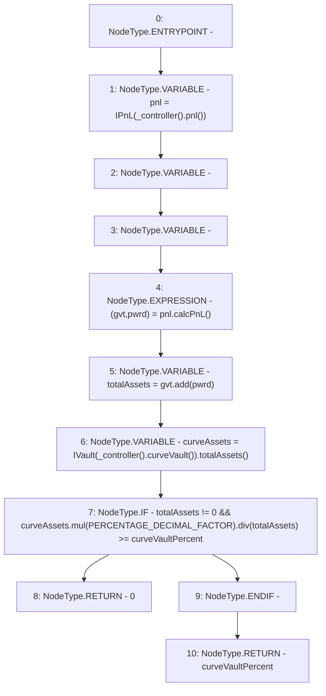

# Context: Insurance.calcSkim

**Contract:** `Insurance` (Inherits: IInsurance, Whitelist, Controllable, Ownable, Context, Constants)
**Signature:** `calcSkim() returns (uint256)`
**Method Selector ID:** `0xe8ca78d3`
**Visibility:** `external`
**Environment-Free:** `Yes`
**Modifiers:** None

### State Variables Interaction
- **Reads:** PERCENTAGE_DECIMAL_FACTOR, curveVaultPercent
- **Writes:** None

### Environment & Verification Flags
- **Uses Foundry Cheatcodes:** No
- **Has Echidna Properties:** No

### Internal Calls Tree
- None

### External Calls / Value Transfers
- `IVault.TMP_186(uint256) = HIGH_LEVEL_CALL, dest:TMP_185(IVault), function:totalAssets, arguments:[]  `
- `SafeMath.TMP_182(uint256) = LIBRARY_CALL, dest:SafeMath, function:SafeMath.add(uint256,uint256), arguments:['gvt', 'pwrd'] `
- `IController.TMP_180(address) = HIGH_LEVEL_CALL, dest:TMP_179(IController), function:pnl, arguments:[]  `
- `SafeMath.TMP_189(uint256) = LIBRARY_CALL, dest:SafeMath, function:SafeMath.div(uint256,uint256), arguments:['TMP_188', 'totalAssets'] `
- `SafeMath.TMP_188(uint256) = LIBRARY_CALL, dest:SafeMath, function:SafeMath.mul(uint256,uint256), arguments:['curveAssets', 'PERCENTAGE_DECIMAL_FACTOR'] `
- `IPnL.TUPLE_2(uint256,uint256) = HIGH_LEVEL_CALL, dest:pnl(IPnL), function:calcPnL, arguments:[]  `
- `IController.TMP_184(address) = HIGH_LEVEL_CALL, dest:TMP_183(IController), function:curveVault, arguments:[]  `

### Control Flow Graph (CFG)


### Source Mapping
Declared in: `certora-ac-datasets/detasets/web3bugs/dataset/web3bugs/17/contracts/insurance/Insurance.sol` on lines **230** to **239**

```solidity
    function calcSkim() external view override returns (uint256) {
        IPnL pnl = IPnL(_controller().pnl());
        (uint256 gvt, uint256 pwrd) = pnl.calcPnL();
        uint256 totalAssets = gvt.add(pwrd);
        uint256 curveAssets = IVault(_controller().curveVault()).totalAssets();
        if (totalAssets != 0 && curveAssets.mul(PERCENTAGE_DECIMAL_FACTOR).div(totalAssets) >= curveVaultPercent) {
            return 0;
        }
        return curveVaultPercent;
    }

```
