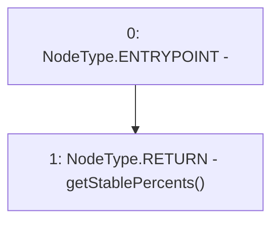

# Context: Insurance.calculateDepositDeltasOnAllVaults

**Contract:** `Insurance` (Inherits: IInsurance, Whitelist, Controllable, Ownable, Context, Constants)
**Signature:** `calculateDepositDeltasOnAllVaults() returns (uint256[3])`
**Method Selector ID:** `0xd697aa87`
**Visibility:** `public`
**Environment-Free:** `Yes`
**Modifiers:** None

### State Variables Interaction
- **Reads:** None
- **Writes:** None

### Environment & Verification Flags
- **Uses Foundry Cheatcodes:** No
- **Has Echidna Properties:** No

### Internal Calls Tree
- None

### External Calls / Value Transfers
- None

### Control Flow Graph (CFG)


### Source Mapping
Declared in: `certora-ac-datasets/detasets/web3bugs/dataset/web3bugs/17/contracts/insurance/Insurance.sol` on lines **138** to **140**

```solidity
    function calculateDepositDeltasOnAllVaults() public view override returns (uint256[N_COINS] memory) {
        return getStablePercents();
    }

```
