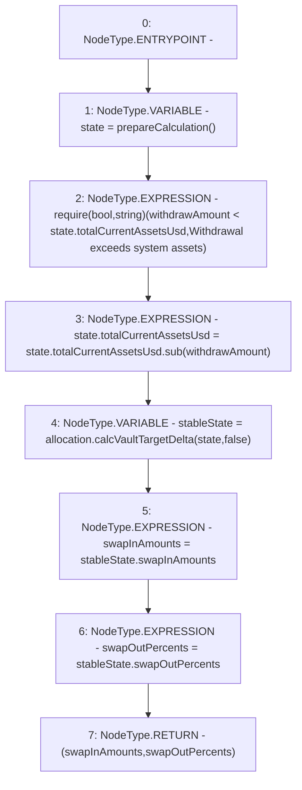

# Context: Insurance.calculateVaultSwapData

**Contract:** `Insurance` (Inherits: IInsurance, Whitelist, Controllable, Ownable, Context, Constants)
**Signature:** `calculateVaultSwapData(uint256) returns (uint256[3], uint256[3])`
**Method Selector ID:** `Internal (No Method ID)`
**Visibility:** `private`
**Environment-Free:** `Yes`
**Modifiers:** None

### State Variables Interaction
- **Reads:** allocation
- **Writes:** None

### Assertion Checks & Business Requirements
- require/assert: `require(bool,string)(withdrawAmount < state.totalCurrentAssetsUsd,Withdrawal exceeds system assets)`

### Environment & Verification Flags
- **Uses Foundry Cheatcodes:** No
- **Has Echidna Properties:** No

### Internal Calls Tree
- None

### External Calls / Value Transfers
- `IAllocation.TMP_287(StablecoinAllocationState) = HIGH_LEVEL_CALL, dest:allocation(IAllocation), function:calcVaultTargetDelta, arguments:['state', 'False']  `
- `SafeMath.TMP_286(uint256) = LIBRARY_CALL, dest:SafeMath, function:SafeMath.sub(uint256,uint256), arguments:['REF_134', 'withdrawAmount'] `

### Control Flow Graph (CFG)


### Source Mapping
Declared in: `certora-ac-datasets/detasets/web3bugs/dataset/web3bugs/17/contracts/insurance/Insurance.sol` on lines **421** to **435**

```solidity
    function calculateVaultSwapData(uint256 withdrawAmount)
        private
        view
        returns (uint256[N_COINS] memory swapInAmounts, uint256[N_COINS] memory swapOutPercents)
    {
        // Calculate total assets and total number of strategies
        SystemState memory state = prepareCalculation();

        require(withdrawAmount < state.totalCurrentAssetsUsd, "Withdrawal exceeds system assets");
        state.totalCurrentAssetsUsd = state.totalCurrentAssetsUsd.sub(withdrawAmount);

        StablecoinAllocationState memory stableState = allocation.calcVaultTargetDelta(state, false);
        swapInAmounts = stableState.swapInAmounts;
        swapOutPercents = stableState.swapOutPercents;
    }

```
