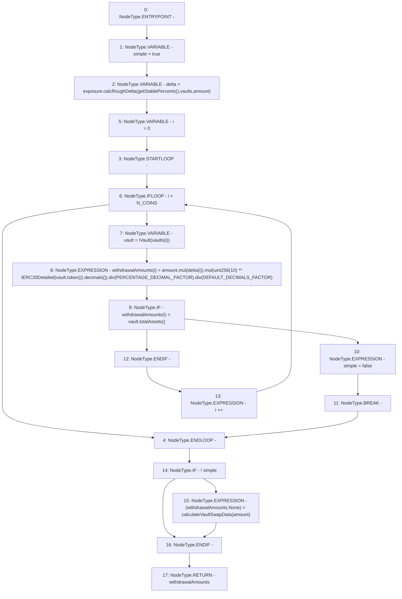

# Context: Insurance.calculateWithdrawalAmountsOnAllVaults

**Contract:** `Insurance` (Inherits: IInsurance, Whitelist, Controllable, Ownable, Context, Constants)
**Signature:** `calculateWithdrawalAmountsOnAllVaults(uint256,address[3]) returns (uint256[3])`
**Method Selector ID:** `Internal (No Method ID)`
**Visibility:** `private`
**Environment-Free:** `Yes`
**Modifiers:** None

### State Variables Interaction
- **Reads:** DEFAULT_DECIMALS_FACTOR, N_COINS, PERCENTAGE_DECIMAL_FACTOR, exposure
- **Writes:** None

### Environment & Verification Flags
- **Uses Foundry Cheatcodes:** No
- **Has Echidna Properties:** No

### Internal Calls Tree
- None

### External Calls / Value Transfers
- `IVault.TMP_272(address) = HIGH_LEVEL_CALL, dest:vault(IVault), function:token, arguments:[]  `
- `IERC20Detailed.TMP_274(uint8) = HIGH_LEVEL_CALL, dest:TMP_273(IERC20Detailed), function:decimals, arguments:[]  `
- `SafeMath.TMP_276(uint256) = LIBRARY_CALL, dest:SafeMath, function:SafeMath.mul(uint256,uint256), arguments:['TMP_270', 'TMP_275'] `
- `SafeMath.TMP_278(uint256) = LIBRARY_CALL, dest:SafeMath, function:SafeMath.div(uint256,uint256), arguments:['TMP_277', 'DEFAULT_DECIMALS_FACTOR'] `
- `IExposure.TMP_267(uint256[3]) = HIGH_LEVEL_CALL, dest:exposure(IExposure), function:calcRoughDelta, arguments:['TMP_266', 'vaults', 'amount']  `
- `IVault.TMP_279(uint256) = HIGH_LEVEL_CALL, dest:vault(IVault), function:totalAssets, arguments:[]  `
- `SafeMath.TMP_270(uint256) = LIBRARY_CALL, dest:SafeMath, function:SafeMath.mul(uint256,uint256), arguments:['amount', 'REF_124'] `
- `SafeMath.TMP_277(uint256) = LIBRARY_CALL, dest:SafeMath, function:SafeMath.div(uint256,uint256), arguments:['TMP_276', 'PERCENTAGE_DECIMAL_FACTOR'] `

### Control Flow Graph (CFG)


### Source Mapping
Declared in: `certora-ac-datasets/detasets/web3bugs/dataset/web3bugs/17/contracts/insurance/Insurance.sol` on lines **387** to **414**

```solidity
    function calculateWithdrawalAmountsOnAllVaults(uint256 amount, address[N_COINS] memory vaults)
        private
        view
        returns (uint256[N_COINS] memory withdrawalAmounts)
    {
        // Simple == true - withdraw from all vaults based on target percents
        bool simple = true;
        // First pass uses rough usd calculations to asses the distribution of withdrawals
        // from the vaults...
        uint256[N_COINS] memory delta = exposure.calcRoughDelta(getStablePercents(), vaults, amount);
        for (uint256 i = 0; i < N_COINS; i++) {
            IVault vault = IVault(vaults[i]);
            withdrawalAmounts[i] = amount
            .mul(delta[i])
            .mul(uint256(10)**IERC20Detailed(vault.token()).decimals())
            .div(PERCENTAGE_DECIMAL_FACTOR)
            .div(DEFAULT_DECIMALS_FACTOR);
            if (withdrawalAmounts[i] > vault.totalAssets()) {
                simple = false;
                break;
            }
        }
        // ...If this doesn't work, we do a more complex calculation to establish
        // how much we need to withdraw
        if (!simple) {
            (withdrawalAmounts, ) = calculateVaultSwapData(amount);
        }
    }

```
