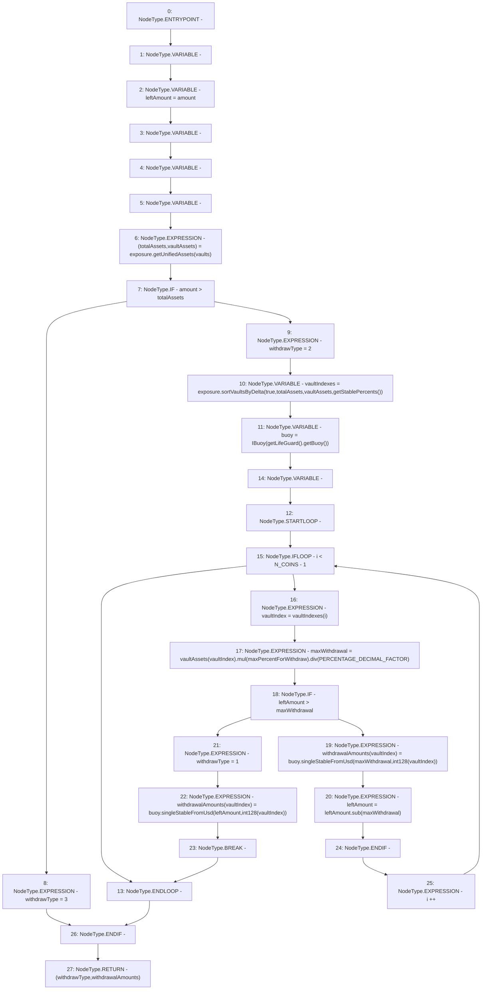

# Context: Insurance.calculateWithdrawalAmountsOnPartVaults

**Contract:** `Insurance` (Inherits: IInsurance, Whitelist, Controllable, Ownable, Context, Constants)
**Signature:** `calculateWithdrawalAmountsOnPartVaults(uint256,address[3]) returns (uint256, uint256[3])`
**Method Selector ID:** `Internal (No Method ID)`
**Visibility:** `private`
**Environment-Free:** `Yes`
**Modifiers:** None

### State Variables Interaction
- **Reads:** N_COINS, PERCENTAGE_DECIMAL_FACTOR, exposure, maxPercentForWithdraw
- **Writes:** None

### Environment & Verification Flags
- **Uses Foundry Cheatcodes:** No
- **Has Echidna Properties:** No

### Internal Calls Tree
- None

### External Calls / Value Transfers
- `SafeMath.TMP_253(uint256) = LIBRARY_CALL, dest:SafeMath, function:SafeMath.mul(uint256,uint256), arguments:['REF_110', 'maxPercentForWithdraw'] `
- `IBuoy.TMP_260(uint256) = HIGH_LEVEL_CALL, dest:buoy(IBuoy), function:singleStableFromUsd, arguments:['leftAmount', 'TMP_259']  `
- `IBuoy.TMP_257(uint256) = HIGH_LEVEL_CALL, dest:buoy(IBuoy), function:singleStableFromUsd, arguments:['maxWithdrawal', 'TMP_256']  `
- `IExposure.TUPLE_4(uint256,uint256[3]) = HIGH_LEVEL_CALL, dest:exposure(IExposure), function:getUnifiedAssets, arguments:['vaults']  `
- `IExposure.TMP_247(uint256[3]) = HIGH_LEVEL_CALL, dest:exposure(IExposure), function:sortVaultsByDelta, arguments:['True', 'totalAssets', 'vaultAssets', 'TMP_246']  `
- `SafeMath.TMP_254(uint256) = LIBRARY_CALL, dest:SafeMath, function:SafeMath.div(uint256,uint256), arguments:['TMP_253', 'PERCENTAGE_DECIMAL_FACTOR'] `
- `ILifeGuard.TMP_249(address) = HIGH_LEVEL_CALL, dest:TMP_248(ILifeGuard), function:getBuoy, arguments:[]  `
- `SafeMath.TMP_258(uint256) = LIBRARY_CALL, dest:SafeMath, function:SafeMath.sub(uint256,uint256), arguments:['leftAmount', 'maxWithdrawal'] `

### Control Flow Graph (CFG)


### Source Mapping
Declared in: `certora-ac-datasets/detasets/web3bugs/dataset/web3bugs/17/contracts/insurance/Insurance.sol` on lines **336** to **376**

```solidity
    function calculateWithdrawalAmountsOnPartVaults(uint256 amount, address[N_COINS] memory vaults)
        private
        view
        returns (uint256 withdrawType, uint256[N_COINS] memory withdrawalAmounts)
    {
        uint256 maxWithdrawal;
        uint256 leftAmount = amount;
        uint256 vaultIndex;
        (uint256 totalAssets, uint256[N_COINS] memory vaultAssets) = exposure.getUnifiedAssets(vaults);
        if (amount > totalAssets) {
            withdrawType = 3;
        } else {
            withdrawType = 2;
            // Get list of vaults order by most exposed => least exposed
            uint256[N_COINS] memory vaultIndexes = exposure.sortVaultsByDelta(
                true,
                totalAssets,
                vaultAssets,
                getStablePercents()
            );

            IBuoy buoy = IBuoy(getLifeGuard().getBuoy());
            // Establish how much needs to be withdrawn from each vault
            for (uint256 i; i < N_COINS - 1; i++) {
                vaultIndex = vaultIndexes[i];
                // Limit of how much can be withdrawn from this vault
                maxWithdrawal = vaultAssets[vaultIndex].mul(maxPercentForWithdraw).div(PERCENTAGE_DECIMAL_FACTOR);
                // If withdraw amount exceeds withdraw capacity, withdraw remainder
                // from next vault in list...
                if (leftAmount > maxWithdrawal) {
                    withdrawalAmounts[vaultIndex] = buoy.singleStableFromUsd(maxWithdrawal, int128(vaultIndex));
                    leftAmount = leftAmount.sub(maxWithdrawal);
                    // ...Else, stop. Withdrawal covered by one vault.
                } else {
                    withdrawType = 1;
                    withdrawalAmounts[vaultIndex] = buoy.singleStableFromUsd(leftAmount, int128(vaultIndex));
                    break;
                }
            }
        }
    }

```
