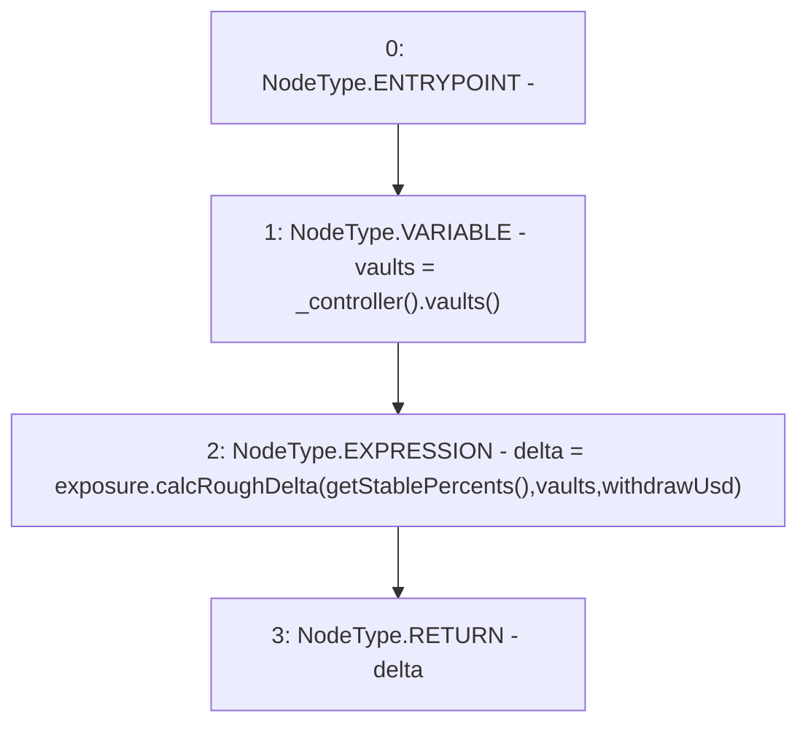

# Context: Insurance.getDelta

**Contract:** `Insurance` (Inherits: IInsurance, Whitelist, Controllable, Ownable, Context, Constants)
**Signature:** `getDelta(uint256) returns (uint256[3])`
**Method Selector ID:** `0x56322586`
**Visibility:** `external`
**Environment-Free:** `Yes`
**Modifiers:** None

### State Variables Interaction
- **Reads:** exposure
- **Writes:** None

### Environment & Verification Flags
- **Uses Foundry Cheatcodes:** No
- **Has Echidna Properties:** No

### Internal Calls Tree
- None

### External Calls / Value Transfers
- `IExposure.TMP_265(uint256[3]) = HIGH_LEVEL_CALL, dest:exposure(IExposure), function:calcRoughDelta, arguments:['TMP_264', 'vaults', 'withdrawUsd']  `
- `IController.TMP_263(address[3]) = HIGH_LEVEL_CALL, dest:TMP_262(IController), function:vaults, arguments:[]  `

### Control Flow Graph (CFG)


### Source Mapping
Declared in: `certora-ac-datasets/detasets/web3bugs/dataset/web3bugs/17/contracts/insurance/Insurance.sol` on lines **380** to **383**

```solidity
    function getDelta(uint256 withdrawUsd) external view override returns (uint256[N_COINS] memory delta) {
        address[N_COINS] memory vaults = _controller().vaults();
        delta = exposure.calcRoughDelta(getStablePercents(), vaults, withdrawUsd);
    }

```
