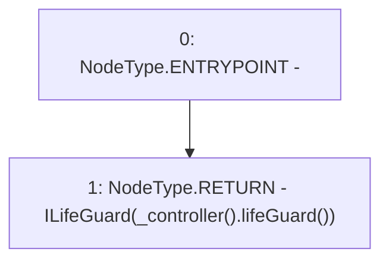

# Context: Insurance.getLifeGuard

**Contract:** `Insurance` (Inherits: IInsurance, Whitelist, Controllable, Ownable, Context, Constants)
**Signature:** `getLifeGuard() returns (ILifeGuard)`
**Method Selector ID:** `Internal (No Method ID)`
**Visibility:** `private`
**Environment-Free:** `Yes`
**Modifiers:** None

### State Variables Interaction
- **Reads:** None
- **Writes:** None

### Environment & Verification Flags
- **Uses Foundry Cheatcodes:** No
- **Has Echidna Properties:** No

### Internal Calls Tree
- None

### External Calls / Value Transfers
- `IController.TMP_289(address) = HIGH_LEVEL_CALL, dest:TMP_288(IController), function:lifeGuard, arguments:[]  `

### Control Flow Graph (CFG)


### Source Mapping
Declared in: `certora-ac-datasets/detasets/web3bugs/dataset/web3bugs/17/contracts/insurance/Insurance.sol` on lines **437** to **439**

```solidity
    function getLifeGuard() private view returns (ILifeGuard) {
        return ILifeGuard(_controller().lifeGuard());
    }

```
