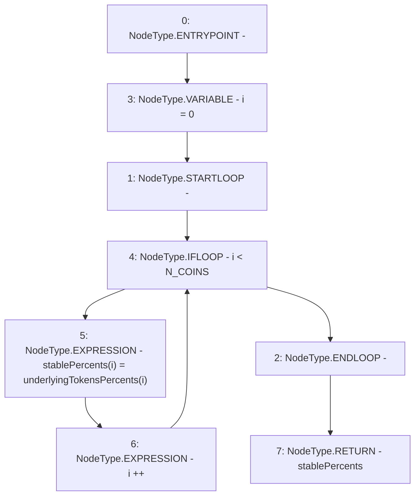

# Context: Insurance.getStablePercents

**Contract:** `Insurance` (Inherits: IInsurance, Whitelist, Controllable, Ownable, Context, Constants)
**Signature:** `getStablePercents() returns (uint256[3])`
**Method Selector ID:** `Internal (No Method ID)`
**Visibility:** `private`
**Environment-Free:** `Yes`
**Modifiers:** None

### State Variables Interaction
- **Reads:** N_COINS, underlyingTokensPercents
- **Writes:** None

### Environment & Verification Flags
- **Uses Foundry Cheatcodes:** No
- **Has Echidna Properties:** No

### Internal Calls Tree
- None

### External Calls / Value Transfers
- None

### Control Flow Graph (CFG)


### Source Mapping
Declared in: `certora-ac-datasets/detasets/web3bugs/dataset/web3bugs/17/contracts/insurance/Insurance.sol` on lines **529** to **533**

```solidity
    function getStablePercents() private view returns (uint256[N_COINS] memory stablePercents) {
        for (uint256 i = 0; i < N_COINS; i++) {
            stablePercents[i] = underlyingTokensPercents[i];
        }
    }

```
