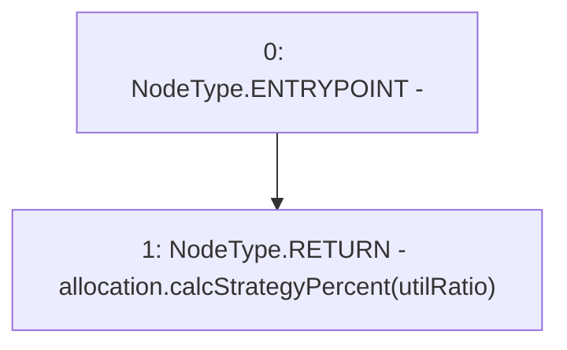

# Context: Insurance.getStrategiesTargetRatio

**Contract:** `Insurance` (Inherits: IInsurance, Whitelist, Controllable, Ownable, Context, Constants)
**Signature:** `getStrategiesTargetRatio(uint256) returns (uint256[])`
**Method Selector ID:** `0x4ececb76`
**Visibility:** `external`
**Environment-Free:** `Yes`
**Modifiers:** None

### State Variables Interaction
- **Reads:** allocation
- **Writes:** None

### Environment & Verification Flags
- **Uses Foundry Cheatcodes:** No
- **Has Echidna Properties:** No

### Internal Calls Tree
- None

### External Calls / Value Transfers
- `IAllocation.TMP_192(uint256[]) = HIGH_LEVEL_CALL, dest:allocation(IAllocation), function:calcStrategyPercent, arguments:['utilRatio']  `

### Control Flow Graph (CFG)


### Source Mapping
Declared in: `certora-ac-datasets/detasets/web3bugs/dataset/web3bugs/17/contracts/insurance/Insurance.sol` on lines **242** to **244**

```solidity
    function getStrategiesTargetRatio(uint256 utilRatio) external view override returns (uint256[] memory) {
        return allocation.calcStrategyPercent(utilRatio);
    }

```
