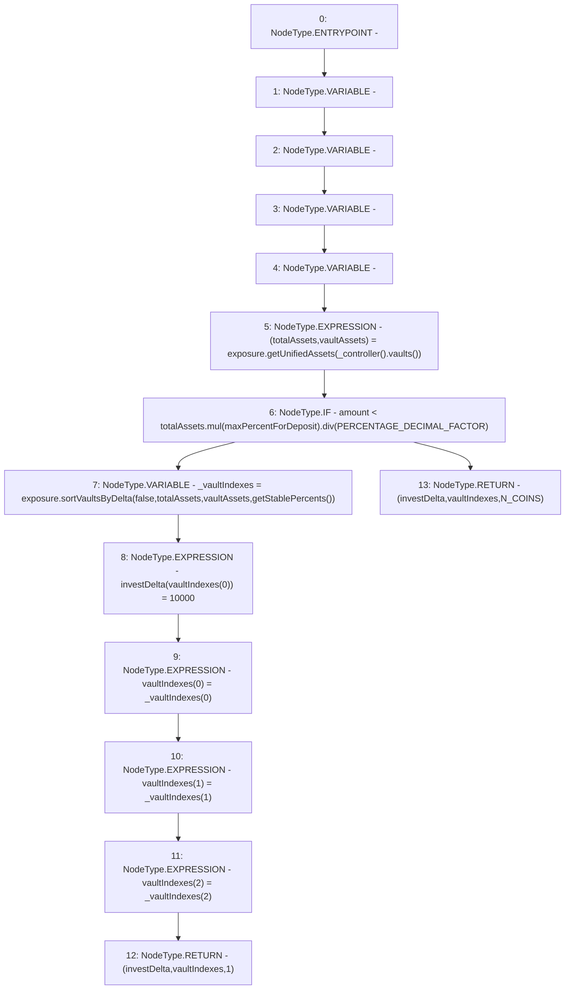

# Context: Insurance.getVaultDeltaForDeposit

**Contract:** `Insurance` (Inherits: IInsurance, Whitelist, Controllable, Ownable, Context, Constants)
**Signature:** `getVaultDeltaForDeposit(uint256) returns (uint256[3], uint256[3], uint256)`
**Method Selector ID:** `0xaa0b9ba5`
**Visibility:** `external`
**Environment-Free:** `Yes`
**Modifiers:** None

### State Variables Interaction
- **Reads:** N_COINS, PERCENTAGE_DECIMAL_FACTOR, exposure, maxPercentForDeposit
- **Writes:** None

### Environment & Verification Flags
- **Uses Foundry Cheatcodes:** No
- **Has Echidna Properties:** No

### Internal Calls Tree
- None

### External Calls / Value Transfers
- `IController.TMP_139(address[3]) = HIGH_LEVEL_CALL, dest:TMP_138(IController), function:vaults, arguments:[]  `
- `SafeMath.TMP_141(uint256) = LIBRARY_CALL, dest:SafeMath, function:SafeMath.div(uint256,uint256), arguments:['TMP_140', 'PERCENTAGE_DECIMAL_FACTOR'] `
- `IExposure.TMP_144(uint256[3]) = HIGH_LEVEL_CALL, dest:exposure(IExposure), function:sortVaultsByDelta, arguments:['False', 'totalAssets', 'vaultAssets', 'TMP_143']  `
- `IExposure.TUPLE_0(uint256,uint256[3]) = HIGH_LEVEL_CALL, dest:exposure(IExposure), function:getUnifiedAssets, arguments:['TMP_139']  `
- `SafeMath.TMP_140(uint256) = LIBRARY_CALL, dest:SafeMath, function:SafeMath.mul(uint256,uint256), arguments:['totalAssets', 'maxPercentForDeposit'] `

### Control Flow Graph (CFG)


### Source Mapping
Declared in: `certora-ac-datasets/detasets/web3bugs/dataset/web3bugs/17/contracts/insurance/Insurance.sol` on lines **144** to **177**

```solidity
    function getVaultDeltaForDeposit(uint256 amount)
        external
        view
        override
        returns (
            uint256[N_COINS] memory,
            uint256[N_COINS] memory,
            uint256
        )
    {
        uint256[N_COINS] memory investDelta;
        uint256[N_COINS] memory vaultIndexes;
        (uint256 totalAssets, uint256[N_COINS] memory vaultAssets) = exposure.getUnifiedAssets(_controller().vaults());
        // If deposited amount is less than the deposit limit for a the system, the
        // deposited is treated as a tuna deposit (single vault target)...
        if (amount < totalAssets.mul(maxPercentForDeposit).div(PERCENTAGE_DECIMAL_FACTOR)) {
            uint256[N_COINS] memory _vaultIndexes = exposure.sortVaultsByDelta(
                false,
                totalAssets,
                vaultAssets,
                getStablePercents()
            );
            investDelta[vaultIndexes[0]] = 10000;
            vaultIndexes[0] = _vaultIndexes[0];
            vaultIndexes[1] = _vaultIndexes[1];
            vaultIndexes[2] = _vaultIndexes[2];

            return (investDelta, vaultIndexes, 1);
            // ...Else its a whale deposit, and the deposit will be spread across all vaults,
            // based on allocation targets
        } else {
            return (investDelta, vaultIndexes, N_COINS);
        }
    }

```
