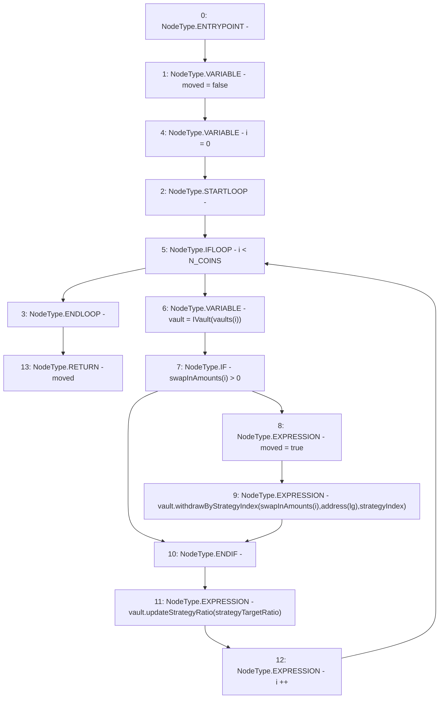

# Context: Insurance.moveAssetsFromVaultsToLifeguard

**Contract:** `Insurance` (Inherits: IInsurance, Whitelist, Controllable, Ownable, Context, Constants)
**Signature:** `moveAssetsFromVaultsToLifeguard(address[3],uint256[3],ILifeGuard,uint256,uint256[]) returns (bool)`
**Method Selector ID:** `Internal (No Method ID)`
**Visibility:** `private`
**Environment-Free:** `Yes`
**Modifiers:** None

### State Variables Interaction
- **Reads:** N_COINS
- **Writes:** None

### Environment & Verification Flags
- **Uses Foundry Cheatcodes:** No
- **Has Echidna Properties:** No

### Internal Calls Tree
- None

### External Calls / Value Transfers
- `IVault.HIGH_LEVEL_CALL, dest:vault(IVault), function:withdrawByStrategyIndex, arguments:['REF_189', 'TMP_328', 'strategyIndex']  `
- `IVault.HIGH_LEVEL_CALL, dest:vault(IVault), function:updateStrategyRatio, arguments:['strategyTargetRatio']  `

### Control Flow Graph (CFG)


### Source Mapping
Declared in: `certora-ac-datasets/detasets/web3bugs/dataset/web3bugs/17/contracts/insurance/Insurance.sol` on lines **508** to **527**

```solidity
    function moveAssetsFromVaultsToLifeguard(
        address[N_COINS] memory vaults,
        uint256[N_COINS] memory swapInAmounts,
        ILifeGuard lg,
        uint256 strategyIndex,
        uint256[] memory strategyTargetRatio
    ) private returns (bool) {
        bool moved = false;

        for (uint256 i = 0; i < N_COINS; i++) {
            IVault vault = IVault(vaults[i]);
            if (swapInAmounts[i] > 0) {
                moved = true;
                vault.withdrawByStrategyIndex(swapInAmounts[i], address(lg), strategyIndex);
            }
            vault.updateStrategyRatio(strategyTargetRatio);
        }

        return moved;
    }

```
