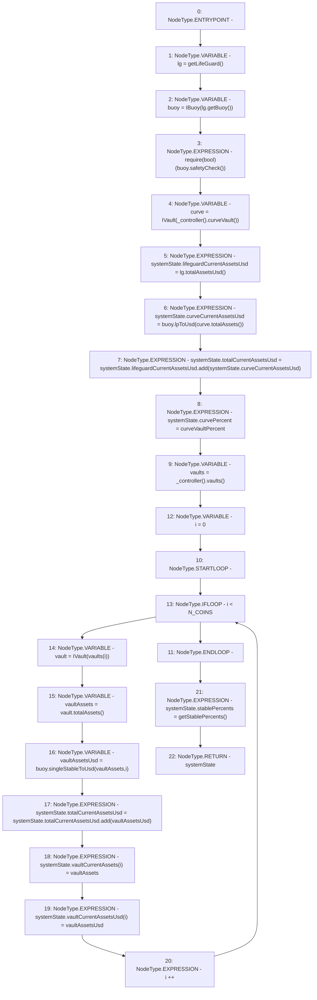

# Context: Insurance.prepareCalculation

**Contract:** `Insurance` (Inherits: IInsurance, Whitelist, Controllable, Ownable, Context, Constants)
**Signature:** `prepareCalculation() returns (SystemState)`
**Method Selector ID:** `0x6c61169a`
**Visibility:** `public`
**Environment-Free:** `Yes`
**Modifiers:** None

### State Variables Interaction
- **Reads:** N_COINS, curveVaultPercent
- **Writes:** None

### Assertion Checks & Business Requirements
- require/assert: `require(bool)(buoy.safetyCheck())`

### Environment & Verification Flags
- **Uses Foundry Cheatcodes:** No
- **Has Echidna Properties:** No

### Internal Calls Tree
- None

### External Calls / Value Transfers
- `SafeMath.TMP_204(uint256) = LIBRARY_CALL, dest:SafeMath, function:SafeMath.add(uint256,uint256), arguments:['REF_68', 'REF_70'] `
- `IVault.TMP_209(uint256) = HIGH_LEVEL_CALL, dest:vault(IVault), function:totalAssets, arguments:[]  `
- `IController.TMP_199(address) = HIGH_LEVEL_CALL, dest:TMP_198(IController), function:curveVault, arguments:[]  `
- `IBuoy.TMP_210(uint256) = HIGH_LEVEL_CALL, dest:buoy(IBuoy), function:singleStableToUsd, arguments:['vaultAssets', 'i']  `
- `SafeMath.TMP_211(uint256) = LIBRARY_CALL, dest:SafeMath, function:SafeMath.add(uint256,uint256), arguments:['REF_77', 'vaultAssetsUsd'] `
- `ILifeGuard.TMP_194(address) = HIGH_LEVEL_CALL, dest:lg(ILifeGuard), function:getBuoy, arguments:[]  `
- `IBuoy.TMP_203(uint256) = HIGH_LEVEL_CALL, dest:buoy(IBuoy), function:lpToUsd, arguments:['TMP_202']  `
- `IVault.TMP_202(uint256) = HIGH_LEVEL_CALL, dest:curve(IVault), function:totalAssets, arguments:[]  `
- `IController.TMP_206(address[3]) = HIGH_LEVEL_CALL, dest:TMP_205(IController), function:vaults, arguments:[]  `
- `ILifeGuard.TMP_201(uint256) = HIGH_LEVEL_CALL, dest:lg(ILifeGuard), function:totalAssetsUsd, arguments:[]  `
- `IBuoy.TMP_196(bool) = HIGH_LEVEL_CALL, dest:buoy(IBuoy), function:safetyCheck, arguments:[]  `

### Control Flow Graph (CFG)


### Source Mapping
Declared in: `certora-ac-datasets/detasets/web3bugs/dataset/web3bugs/17/contracts/insurance/Insurance.sol` on lines **247** to **269**

```solidity
    function prepareCalculation() public view returns (SystemState memory systemState) {
        ILifeGuard lg = getLifeGuard();
        IBuoy buoy = IBuoy(lg.getBuoy());
        require(buoy.safetyCheck());
        IVault curve = IVault(_controller().curveVault());
        systemState.lifeguardCurrentAssetsUsd = lg.totalAssetsUsd();
        systemState.curveCurrentAssetsUsd = buoy.lpToUsd(curve.totalAssets());
        systemState.totalCurrentAssetsUsd = systemState.lifeguardCurrentAssetsUsd.add(
            systemState.curveCurrentAssetsUsd
        );
        systemState.curvePercent = curveVaultPercent;
        address[N_COINS] memory vaults = _controller().vaults();
        // Stablecoin total assets
        for (uint256 i = 0; i < N_COINS; i++) {
            IVault vault = IVault(vaults[i]);
            uint256 vaultAssets = vault.totalAssets();
            uint256 vaultAssetsUsd = buoy.singleStableToUsd(vaultAssets, i);
            systemState.totalCurrentAssetsUsd = systemState.totalCurrentAssetsUsd.add(vaultAssetsUsd);
            systemState.vaultCurrentAssets[i] = vaultAssets;
            systemState.vaultCurrentAssetsUsd[i] = vaultAssetsUsd;
        }
        systemState.stablePercents = getStablePercents();
    }

```
