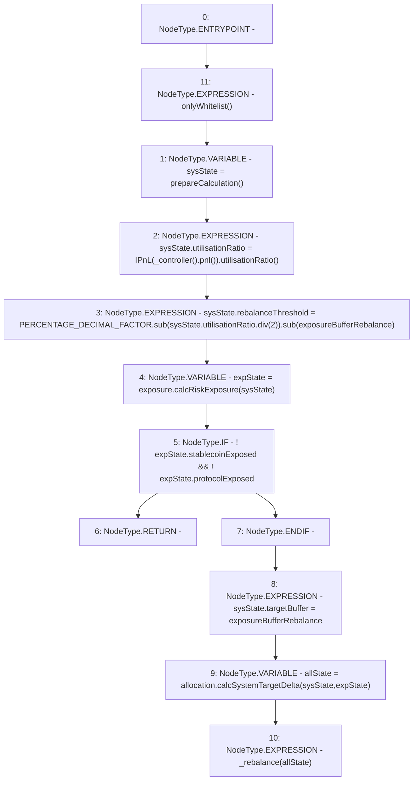

# Context: Insurance.rebalance

**Contract:** `Insurance` (Inherits: IInsurance, Whitelist, Controllable, Ownable, Context, Constants)
**Signature:** `rebalance()`
**Method Selector ID:** `0x7d7c2a1c`
**Visibility:** `external`
**Environment-Free:** `No (reads EVM state context)`
**Modifiers:**
- `onlyWhitelist`
  ```solidity
  modifier onlyWhitelist() {
          require(whitelist[msg.sender], "only whitelist");
          _;
      }
  ```

### State Variables Interaction
- **Reads:** PERCENTAGE_DECIMAL_FACTOR, allocation, exposure, exposureBufferRebalance
- **Writes:** None

### Environment & Verification Flags
- **Uses Foundry Cheatcodes:** No
- **Has Echidna Properties:** No

### Internal Calls Tree
- None

### External Calls / Value Transfers
- `SafeMath.TMP_164(uint256) = LIBRARY_CALL, dest:SafeMath, function:SafeMath.div(uint256,uint256), arguments:['REF_42', '2'] `
- `IAllocation.TMP_171(AllocationState) = HIGH_LEVEL_CALL, dest:allocation(IAllocation), function:calcSystemTargetDelta, arguments:['sysState', 'expState']  `
- `IPnL.TMP_163(uint256) = HIGH_LEVEL_CALL, dest:TMP_162(IPnL), function:utilisationRatio, arguments:[]  `
- `SafeMath.TMP_166(uint256) = LIBRARY_CALL, dest:SafeMath, function:SafeMath.sub(uint256,uint256), arguments:['TMP_165', 'exposureBufferRebalance'] `
- `IController.TMP_161(address) = HIGH_LEVEL_CALL, dest:TMP_160(IController), function:pnl, arguments:[]  `
- `SafeMath.TMP_165(uint256) = LIBRARY_CALL, dest:SafeMath, function:SafeMath.sub(uint256,uint256), arguments:['PERCENTAGE_DECIMAL_FACTOR', 'TMP_164'] `
- `IExposure.TMP_167(ExposureState) = HIGH_LEVEL_CALL, dest:exposure(IExposure), function:calcRiskExposure, arguments:['sysState']  `

### Control Flow Graph (CFG)


### Source Mapping
Declared in: `certora-ac-datasets/detasets/web3bugs/dataset/web3bugs/17/contracts/insurance/Insurance.sol` on lines **202** to **215**

```solidity
    function rebalance() external override onlyWhitelist {
        SystemState memory sysState = prepareCalculation();
        sysState.utilisationRatio = IPnL(_controller().pnl()).utilisationRatio();
        sysState.rebalanceThreshold = PERCENTAGE_DECIMAL_FACTOR.sub(sysState.utilisationRatio.div(2)).sub(
            exposureBufferRebalance
        );
        ExposureState memory expState = exposure.calcRiskExposure(sysState);
        /// If the system is in an OK state, do nothing...
        if (!expState.stablecoinExposed && !expState.protocolExposed) return;
        /// ...Else, trigger a rebalance
        sysState.targetBuffer = exposureBufferRebalance;
        AllocationState memory allState = allocation.calcSystemTargetDelta(sysState, expState);
        _rebalance(allState);
    }

```
