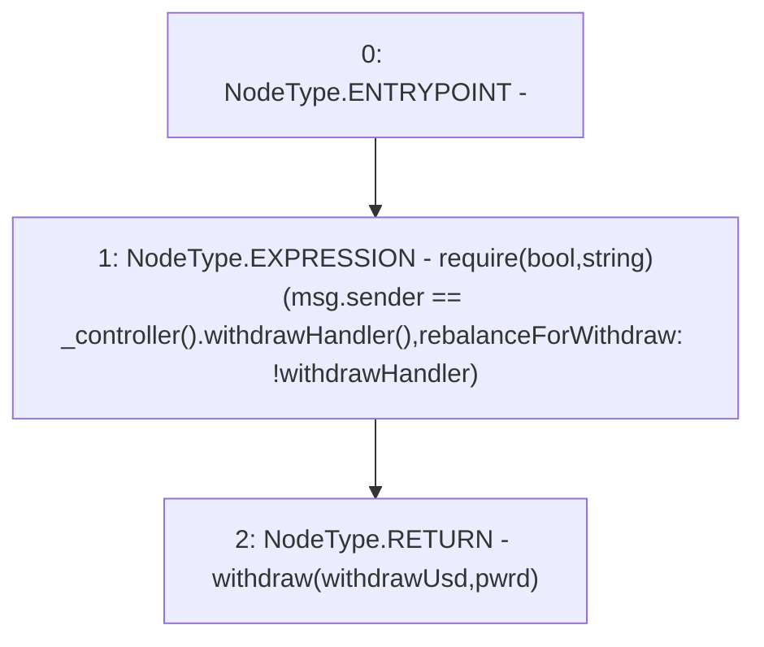

# Context: Insurance.rebalanceForWithdraw

**Contract:** `Insurance` (Inherits: IInsurance, Whitelist, Controllable, Ownable, Context, Constants)
**Signature:** `rebalanceForWithdraw(uint256,bool) returns (bool)`
**Method Selector ID:** `0x7901cc09`
**Visibility:** `external`
**Environment-Free:** `No (reads EVM state context)`
**Modifiers:** None

### State Variables Interaction
- **Reads:** None
- **Writes:** None

### Assertion Checks & Business Requirements
- require/assert: `require(bool,string)(msg.sender == _controller().withdrawHandler(),rebalanceForWithdraw: !withdrawHandler)`

### Environment & Verification Flags
- **Uses Foundry Cheatcodes:** No
- **Has Echidna Properties:** No

### Internal Calls Tree
- None

### External Calls / Value Transfers
- `IController.TMP_175(address) = HIGH_LEVEL_CALL, dest:TMP_174(IController), function:withdrawHandler, arguments:[]  `

### Control Flow Graph (CFG)


### Source Mapping
Declared in: `certora-ac-datasets/detasets/web3bugs/dataset/web3bugs/17/contracts/insurance/Insurance.sol` on lines **221** to **224**

```solidity
    function rebalanceForWithdraw(uint256 withdrawUsd, bool pwrd) external override returns (bool) {
        require(msg.sender == _controller().withdrawHandler(), "rebalanceForWithdraw: !withdrawHandler");
        return withdraw(withdrawUsd, pwrd);
    }

```
