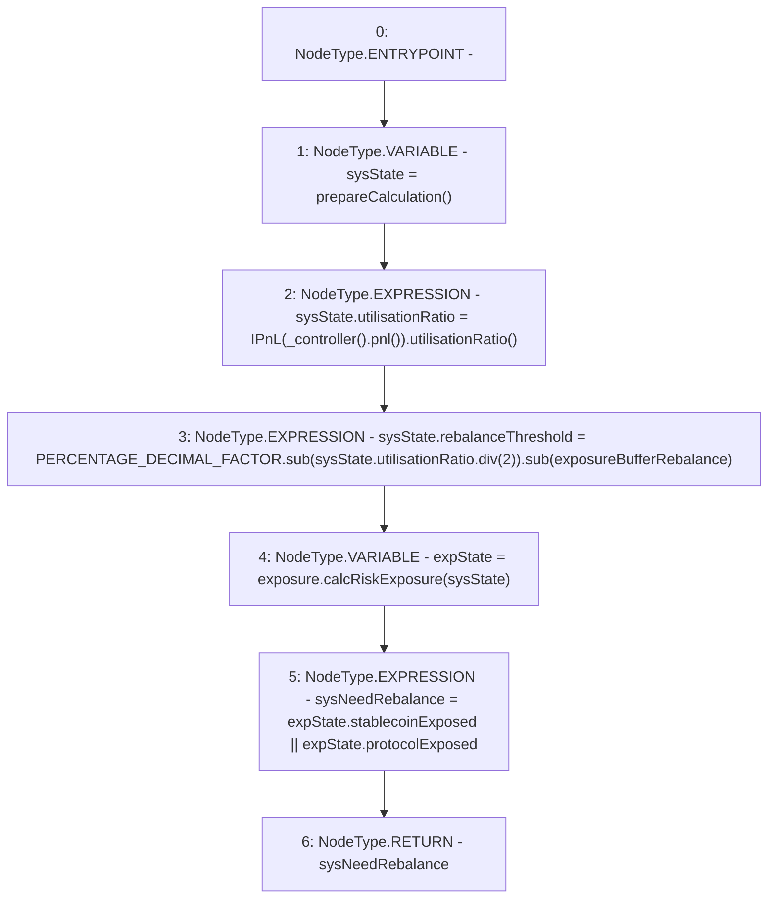

# Context: Insurance.rebalanceTrigger

**Contract:** `Insurance` (Inherits: IInsurance, Whitelist, Controllable, Ownable, Context, Constants)
**Signature:** `rebalanceTrigger() returns (bool)`
**Method Selector ID:** `0x1bac3fdb`
**Visibility:** `external`
**Environment-Free:** `Yes`
**Modifiers:** None

### State Variables Interaction
- **Reads:** PERCENTAGE_DECIMAL_FACTOR, exposure, exposureBufferRebalance
- **Writes:** None

### Environment & Verification Flags
- **Uses Foundry Cheatcodes:** No
- **Has Echidna Properties:** No

### Internal Calls Tree
- None

### External Calls / Value Transfers
- `IExposure.TMP_157(ExposureState) = HIGH_LEVEL_CALL, dest:exposure(IExposure), function:calcRiskExposure, arguments:['sysState']  `
- `SafeMath.TMP_155(uint256) = LIBRARY_CALL, dest:SafeMath, function:SafeMath.sub(uint256,uint256), arguments:['PERCENTAGE_DECIMAL_FACTOR', 'TMP_154'] `
- `SafeMath.TMP_156(uint256) = LIBRARY_CALL, dest:SafeMath, function:SafeMath.sub(uint256,uint256), arguments:['TMP_155', 'exposureBufferRebalance'] `
- `IPnL.TMP_153(uint256) = HIGH_LEVEL_CALL, dest:TMP_152(IPnL), function:utilisationRatio, arguments:[]  `
- `SafeMath.TMP_154(uint256) = LIBRARY_CALL, dest:SafeMath, function:SafeMath.div(uint256,uint256), arguments:['REF_31', '2'] `
- `IController.TMP_151(address) = HIGH_LEVEL_CALL, dest:TMP_150(IController), function:pnl, arguments:[]  `

### Control Flow Graph (CFG)


### Source Mapping
Declared in: `certora-ac-datasets/detasets/web3bugs/dataset/web3bugs/17/contracts/insurance/Insurance.sol` on lines **188** to **196**

```solidity
    function rebalanceTrigger() external view override returns (bool sysNeedRebalance) {
        SystemState memory sysState = prepareCalculation();
        sysState.utilisationRatio = IPnL(_controller().pnl()).utilisationRatio();
        sysState.rebalanceThreshold = PERCENTAGE_DECIMAL_FACTOR.sub(sysState.utilisationRatio.div(2)).sub(
            exposureBufferRebalance
        );
        ExposureState memory expState = exposure.calcRiskExposure(sysState);
        sysNeedRebalance = expState.stablecoinExposed || expState.protocolExposed;
    }

```
