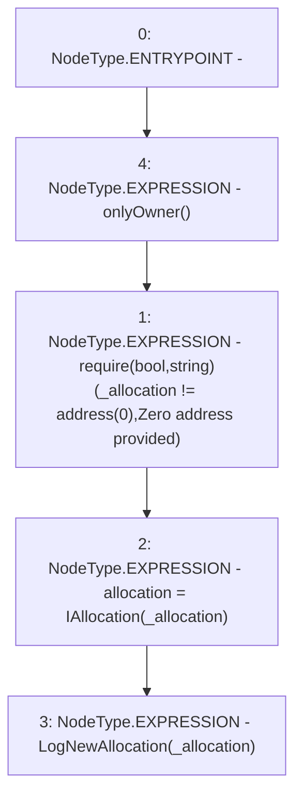

# Context: Insurance.setAllocation

**Contract:** `Insurance` (Inherits: IInsurance, Whitelist, Controllable, Ownable, Context, Constants)
**Signature:** `setAllocation(address)`
**Method Selector ID:** `0x4d0a720b`
**Visibility:** `external`
**Environment-Free:** `No (reads EVM state context)`
**Modifiers:**
- `onlyOwner`
  ```solidity
  modifier onlyOwner() {
          require(owner() == _msgSender(), "Ownable: caller is not the owner");
          _;
      }
  ```

### State Variables Interaction
- **Reads:** None
- **Writes:** allocation

### Assertion Checks & Business Requirements
- require/assert: `require(bool,string)(_allocation != address(0),Zero address provided)`

### Environment & Verification Flags
- **Uses Foundry Cheatcodes:** No
- **Has Echidna Properties:** No

### Internal Calls Tree
- None

### External Calls / Value Transfers
- None

### Control Flow Graph (CFG)


### Source Mapping
Declared in: `certora-ac-datasets/detasets/web3bugs/dataset/web3bugs/17/contracts/insurance/Insurance.sol` on lines **83** to **87**

```solidity
    function setAllocation(address _allocation) external onlyOwner {
        require(_allocation != address(0), "Zero address provided");
        allocation = IAllocation(_allocation);
        emit LogNewAllocation(_allocation);
    }

```
