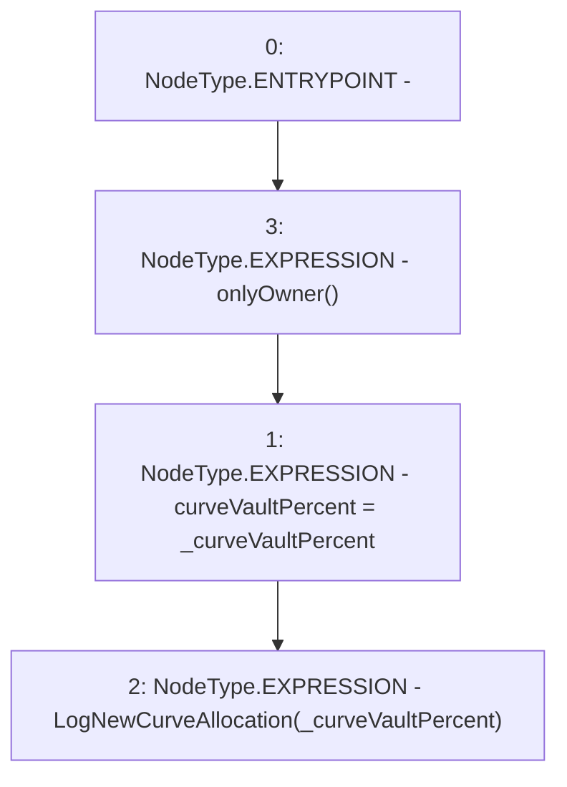

# Context: Insurance.setCurveVaultPercent

**Contract:** `Insurance` (Inherits: IInsurance, Whitelist, Controllable, Ownable, Context, Constants)
**Signature:** `setCurveVaultPercent(uint256)`
**Method Selector ID:** `0x2b373cd8`
**Visibility:** `external`
**Environment-Free:** `No (reads EVM state context)`
**Modifiers:**
- `onlyOwner`
  ```solidity
  modifier onlyOwner() {
          require(owner() == _msgSender(), "Ownable: caller is not the owner");
          _;
      }
  ```

### State Variables Interaction
- **Reads:** None
- **Writes:** curveVaultPercent

### Environment & Verification Flags
- **Uses Foundry Cheatcodes:** No
- **Has Echidna Properties:** No

### Internal Calls Tree
- None

### External Calls / Value Transfers
- None

### Control Flow Graph (CFG)


### Source Mapping
Declared in: `certora-ac-datasets/detasets/web3bugs/dataset/web3bugs/17/contracts/insurance/Insurance.sol` on lines **106** to **109**

```solidity
    function setCurveVaultPercent(uint256 _curveVaultPercent) external onlyOwner {
        curveVaultPercent = _curveVaultPercent;
        emit LogNewCurveAllocation(_curveVaultPercent);
    }

```
