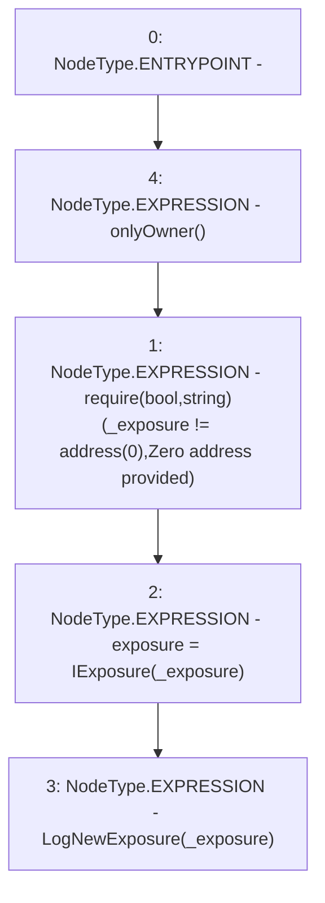

# Context: Insurance.setExposure

**Contract:** `Insurance` (Inherits: IInsurance, Whitelist, Controllable, Ownable, Context, Constants)
**Signature:** `setExposure(address)`
**Method Selector ID:** `0x46f03038`
**Visibility:** `external`
**Environment-Free:** `No (reads EVM state context)`
**Modifiers:**
- `onlyOwner`
  ```solidity
  modifier onlyOwner() {
          require(owner() == _msgSender(), "Ownable: caller is not the owner");
          _;
      }
  ```

### State Variables Interaction
- **Reads:** None
- **Writes:** exposure

### Assertion Checks & Business Requirements
- require/assert: `require(bool,string)(_exposure != address(0),Zero address provided)`

### Environment & Verification Flags
- **Uses Foundry Cheatcodes:** No
- **Has Echidna Properties:** No

### Internal Calls Tree
- None

### External Calls / Value Transfers
- None

### Control Flow Graph (CFG)


### Source Mapping
Declared in: `certora-ac-datasets/detasets/web3bugs/dataset/web3bugs/17/contracts/insurance/Insurance.sol` on lines **91** to **95**

```solidity
    function setExposure(address _exposure) external onlyOwner {
        require(_exposure != address(0), "Zero address provided");
        exposure = IExposure(_exposure);
        emit LogNewExposure(_exposure);
    }

```
