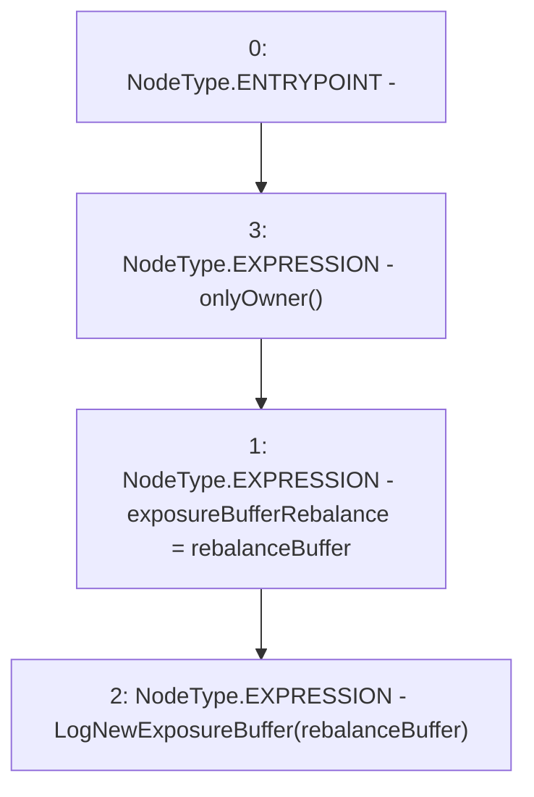

# Context: Insurance.setExposureBufferRebalance

**Contract:** `Insurance` (Inherits: IInsurance, Whitelist, Controllable, Ownable, Context, Constants)
**Signature:** `setExposureBufferRebalance(uint256)`
**Method Selector ID:** `0x4869568b`
**Visibility:** `external`
**Environment-Free:** `No (reads EVM state context)`
**Modifiers:**
- `onlyOwner`
  ```solidity
  modifier onlyOwner() {
          require(owner() == _msgSender(), "Ownable: caller is not the owner");
          _;
      }
  ```

### State Variables Interaction
- **Reads:** None
- **Writes:** exposureBufferRebalance

### Environment & Verification Flags
- **Uses Foundry Cheatcodes:** No
- **Has Echidna Properties:** No

### Internal Calls Tree
- None

### External Calls / Value Transfers
- None

### Control Flow Graph (CFG)


### Source Mapping
Declared in: `certora-ac-datasets/detasets/web3bugs/dataset/web3bugs/17/contracts/insurance/Insurance.sol` on lines **113** to **116**

```solidity
    function setExposureBufferRebalance(uint256 rebalanceBuffer) external onlyOwner {
        exposureBufferRebalance = rebalanceBuffer;
        emit LogNewExposureBuffer(rebalanceBuffer);
    }

```
