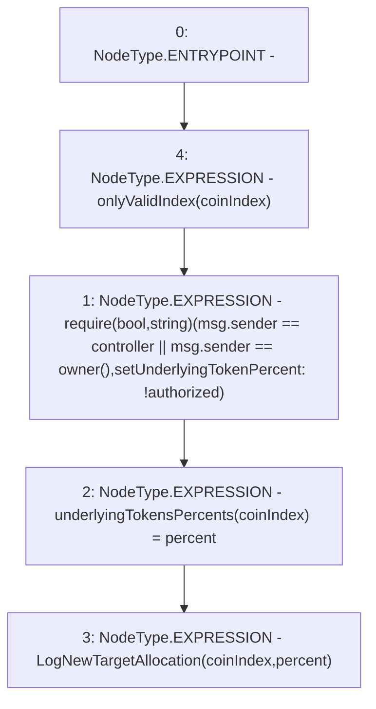

# Context: Insurance.setUnderlyingTokenPercent

**Contract:** `Insurance` (Inherits: IInsurance, Whitelist, Controllable, Ownable, Context, Constants)
**Signature:** `setUnderlyingTokenPercent(uint256,uint256)`
**Method Selector ID:** `0xbd62216d`
**Visibility:** `external`
**Environment-Free:** `No (reads EVM state context)`
**Modifiers:**
- `onlyValidIndex`
  ```solidity
  modifier onlyValidIndex(uint256 index) {
          require(index >= 0 && index < N_COINS, "Invalid index value.");
          _;
      }
  ```

### State Variables Interaction
- **Reads:** controller
- **Writes:** underlyingTokensPercents

### Assertion Checks & Business Requirements
- require/assert: `require(bool,string)(msg.sender == controller || msg.sender == owner(),setUnderlyingTokenPercent: !authorized)`

### Environment & Verification Flags
- **Uses Foundry Cheatcodes:** No
- **Has Echidna Properties:** No

### Internal Calls Tree
- None

### External Calls / Value Transfers
- None

### Control Flow Graph (CFG)


### Source Mapping
Declared in: `certora-ac-datasets/detasets/web3bugs/dataset/web3bugs/17/contracts/insurance/Insurance.sol` on lines **100** to **104**

```solidity
    function setUnderlyingTokenPercent(uint256 coinIndex, uint256 percent) external override onlyValidIndex(coinIndex) {
        require(msg.sender == controller || msg.sender == owner(), "setUnderlyingTokenPercent: !authorized");
        underlyingTokensPercents[coinIndex] = percent;
        emit LogNewTargetAllocation(coinIndex, percent);
    }

```
