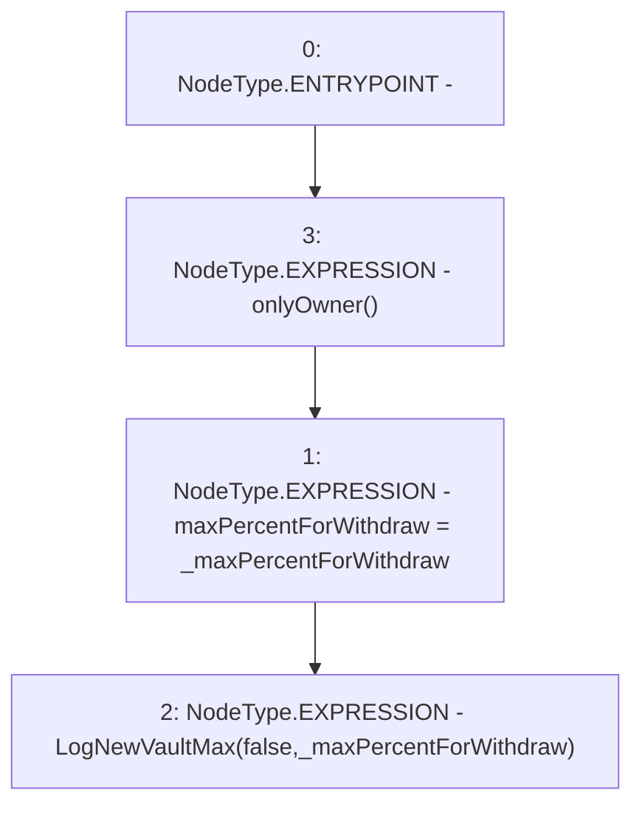

# Context: Insurance.setWhaleThresholdWithdraw

**Contract:** `Insurance` (Inherits: IInsurance, Whitelist, Controllable, Ownable, Context, Constants)
**Signature:** `setWhaleThresholdWithdraw(uint256)`
**Method Selector ID:** `0xc21a5fcb`
**Visibility:** `external`
**Environment-Free:** `No (reads EVM state context)`
**Modifiers:**
- `onlyOwner`
  ```solidity
  modifier onlyOwner() {
          require(owner() == _msgSender(), "Ownable: caller is not the owner");
          _;
      }
  ```

### State Variables Interaction
- **Reads:** None
- **Writes:** maxPercentForWithdraw

### Environment & Verification Flags
- **Uses Foundry Cheatcodes:** No
- **Has Echidna Properties:** No

### Internal Calls Tree
- None

### External Calls / Value Transfers
- None

### Control Flow Graph (CFG)


### Source Mapping
Declared in: `certora-ac-datasets/detasets/web3bugs/dataset/web3bugs/17/contracts/insurance/Insurance.sol` on lines **122** to **125**

```solidity
    function setWhaleThresholdWithdraw(uint256 _maxPercentForWithdraw) external onlyOwner {
        maxPercentForWithdraw = _maxPercentForWithdraw;
        emit LogNewVaultMax(false, _maxPercentForWithdraw);
    }

```
