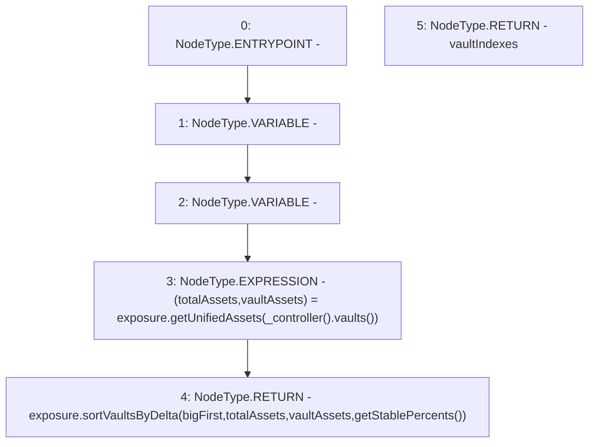

# Context: Insurance.sortVaultsByDelta

**Contract:** `Insurance` (Inherits: IInsurance, Whitelist, Controllable, Ownable, Context, Constants)
**Signature:** `sortVaultsByDelta(bool) returns (uint256[3])`
**Method Selector ID:** `0x76e448b0`
**Visibility:** `external`
**Environment-Free:** `Yes`
**Modifiers:** None

### State Variables Interaction
- **Reads:** exposure
- **Writes:** None

### Environment & Verification Flags
- **Uses Foundry Cheatcodes:** No
- **Has Echidna Properties:** No

### Internal Calls Tree
- None

### External Calls / Value Transfers
- `IController.TMP_146(address[3]) = HIGH_LEVEL_CALL, dest:TMP_145(IController), function:vaults, arguments:[]  `
- `IExposure.TMP_148(uint256[3]) = HIGH_LEVEL_CALL, dest:exposure(IExposure), function:sortVaultsByDelta, arguments:['bigFirst', 'totalAssets', 'vaultAssets', 'TMP_147']  `
- `IExposure.TUPLE_1(uint256,uint256[3]) = HIGH_LEVEL_CALL, dest:exposure(IExposure), function:getUnifiedAssets, arguments:['TMP_146']  `

### Control Flow Graph (CFG)


### Source Mapping
Declared in: `certora-ac-datasets/detasets/web3bugs/dataset/web3bugs/17/contracts/insurance/Insurance.sol` on lines **182** to **185**

```solidity
    function sortVaultsByDelta(bool bigFirst) external view override returns (uint256[N_COINS] memory vaultIndexes) {
        (uint256 totalAssets, uint256[N_COINS] memory vaultAssets) = exposure.getUnifiedAssets(_controller().vaults());
        return exposure.sortVaultsByDelta(bigFirst, totalAssets, vaultAssets, getStablePercents());
    }

```
