# Context: Insurance.withdraw

**Contract:** `Insurance` (Inherits: IInsurance, Whitelist, Controllable, Ownable, Context, Constants)
**Signature:** `withdraw(uint256,bool) returns (bool)`
**Method Selector ID:** `Internal (No Method ID)`
**Visibility:** `private`
**Environment-Free:** `Yes`
**Modifiers:** None

### State Variables Interaction
- **Reads:** N_COINS
- **Writes:** None

### Assertion Checks & Business Requirements
- require/assert: `require(bool,string)(curveVaultUsd > leftUsd,no enough system assets)`

### Environment & Verification Flags
- **Uses Foundry Cheatcodes:** No
- **Has Echidna Properties:** No

### Internal Calls Tree
- None

### External Calls / Value Transfers
- `IVault.TMP_221(uint256) = HIGH_LEVEL_CALL, dest:TMP_220(IVault), function:totalAssets, arguments:[]  `
- `IVault.TMP_238(uint256) = HIGH_LEVEL_CALL, dest:curveVault(IVault), function:totalAssets, arguments:[]  `
- `IBuoy.TMP_242(uint256) = HIGH_LEVEL_CALL, dest:buoy(IBuoy), function:usdToLp, arguments:['leftUsd']  `
- `IVault.HIGH_LEVEL_CALL, dest:curveVault(IVault), function:withdraw, arguments:['TMP_242', 'TMP_243']  `
- `IController.TMP_215(address[3]) = HIGH_LEVEL_CALL, dest:TMP_214(IController), function:vaults, arguments:[]  `
- `IVault.HIGH_LEVEL_CALL, dest:TMP_226(IVault), function:withdrawByStrategyOrder, arguments:['REF_91', 'TMP_227', 'pwrd']  `
- `IController.TMP_236(address) = HIGH_LEVEL_CALL, dest:TMP_235(IController), function:curveVault, arguments:[]  `
- `ILifeGuard.TMP_231(address) = HIGH_LEVEL_CALL, dest:lg(ILifeGuard), function:getBuoy, arguments:[]  `
- `SafeMath.TMP_234(uint256) = LIBRARY_CALL, dest:SafeMath, function:SafeMath.sub(uint256,uint256), arguments:['amount', 'TMP_233'] `
- `IBuoy.TMP_239(uint256) = HIGH_LEVEL_CALL, dest:buoy(IBuoy), function:lpToUsd, arguments:['TMP_238']  `
- `IBuoy.TMP_233(uint256) = HIGH_LEVEL_CALL, dest:buoy(IBuoy), function:stableToUsd, arguments:['_withdrawalAmounts', 'False']  `

### Control Flow Graph (CFG)

```mermaid
flowchart TD
    Node_0["0: NodeType.ENTRYPOINT - "]
    Node_0 --> Node_1
    Node_1["1: NodeType.VARIABLE - vaults = _controller().vaults()"]
    Node_1 --> Node_2
    Node_2["2: NodeType.VARIABLE - "]
    Node_2 --> Node_3
    Node_3["3: NodeType.VARIABLE - "]
    Node_3 --> Node_4
    Node_4["4: NodeType.EXPRESSION - (withdrawType,withdrawalAmounts) = calculateWithdrawalAmountsOnPartVaults(amount,vaults)"]
    Node_4 --> Node_5
    Node_5["5: NodeType.IF - withdrawType > 1"]
    Node_5 --> Node_6
    Node_5 --> Node_15
    Node_6["6: NodeType.IF - withdrawType == 2"]
    Node_6 --> Node_7
    Node_6 --> Node_10
    Node_7["7: NodeType.EXPRESSION - withdrawalAmounts = calculateWithdrawalAmountsOnAllVaults(amount,vaults)"]
    Node_7 --> Node_14
    Node_8["8: NodeType.STARTLOOP - "]
    Node_8 --> Node_11
    Node_9["9: NodeType.ENDLOOP - "]
    Node_9 --> Node_14
    Node_10["10: NodeType.VARIABLE - "]
    Node_10 --> Node_8
    Node_11["11: NodeType.IFLOOP - i < N_COINS"]
    Node_11 --> Node_12
    Node_11 --> Node_9
    Node_12["12: NodeType.EXPRESSION - withdrawalAmounts(i) = IVault(vaults(i)).totalAssets()"]
    Node_12 --> Node_13
    Node_13["13: NodeType.EXPRESSION - i ++"]
    Node_13 --> Node_11
    Node_14["14: NodeType.ENDIF - "]
    Node_14 --> Node_15
    Node_15["15: NodeType.ENDIF - "]
    Node_15 --> Node_16
    Node_16["16: NodeType.VARIABLE - lg = getLifeGuard()"]
    Node_16 --> Node_19
    Node_17["17: NodeType.STARTLOOP - "]
    Node_17 --> Node_20
    Node_18["18: NodeType.ENDLOOP - "]
    Node_18 --> Node_25
    Node_19["19: NodeType.VARIABLE - i_scope_0 = 0"]
    Node_19 --> Node_17
    Node_20["20: NodeType.IFLOOP - i_scope_0 < N_COINS"]
    Node_20 --> Node_21
    Node_20 --> Node_18
    Node_21["21: NodeType.IF - withdrawalAmounts(i_scope_0) > 0"]
    Node_21 --> Node_22
    Node_21 --> Node_23
    Node_22["22: NodeType.EXPRESSION - IVault(vaults(i_scope_0)).withdrawByStrategyOrder(withdrawalAmounts(i_scope_0),address(lg),pwrd)"]
    Node_22 --> Node_23
    Node_23["23: NodeType.ENDIF - "]
    Node_23 --> Node_24
    Node_24["24: NodeType.EXPRESSION - i_scope_0 ++"]
    Node_24 --> Node_20
    Node_25["25: NodeType.IF - withdrawType == 3"]
    Node_25 --> Node_26
    Node_25 --> Node_37
    Node_26["26: NodeType.VARIABLE - buoy = IBuoy(lg.getBuoy())"]
    Node_26 --> Node_27
    Node_27["27: NodeType.VARIABLE - "]
    Node_27 --> Node_28
    Node_28["28: NodeType.EXPRESSION - _withdrawalAmounts(0) = withdrawalAmounts(0)"]
    Node_28 --> Node_29
    Node_29["29: NodeType.EXPRESSION - _withdrawalAmounts(1) = withdrawalAmounts(1)"]
    Node_29 --> Node_30
    Node_30["30: NodeType.EXPRESSION - _withdrawalAmounts(2) = withdrawalAmounts(2)"]
    Node_30 --> Node_31
    Node_31["31: NodeType.VARIABLE - leftUsd = amount.sub(buoy.stableToUsd(_withdrawalAmounts,false))"]
    Node_31 --> Node_32
    Node_32["32: NodeType.VARIABLE - curveVault = IVault(_controller().curveVault())"]
    Node_32 --> Node_33
    Node_33["33: NodeType.VARIABLE - curveVaultUsd = buoy.lpToUsd(curveVault.totalAssets())"]
    Node_33 --> Node_34
    Node_34["34: NodeType.EXPRESSION - require(bool,string)(curveVaultUsd > leftUsd,no enough system assets)"]
    Node_34 --> Node_35
    Node_35["35: NodeType.EXPRESSION - curveVault.withdraw(buoy.usdToLp(leftUsd),address(lg))"]
    Node_35 --> Node_36
    Node_36["36: NodeType.EXPRESSION - curve = true"]
    Node_36 --> Node_37
    Node_37["37: NodeType.ENDIF - "]
    Node_37 --> Node_38
    Node_38["38: NodeType.RETURN - curve"]
```


### Source Mapping
Declared in: `certora-ac-datasets/detasets/web3bugs/dataset/web3bugs/17/contracts/insurance/Insurance.sol` on lines **276** to **327**

```solidity
    function withdraw(uint256 amount, bool pwrd) private returns (bool curve) {
        address[N_COINS] memory vaults = _controller().vaults();

        // Determine if it's possible to withdraw from one or two vaults without breaking exposure
        (uint256 withdrawType, uint256[N_COINS] memory withdrawalAmounts) = calculateWithdrawalAmountsOnPartVaults(
            amount,
            vaults
        );

        // If it's not possible to withdraw from a subset of the vaults, calculate how much
        // to withdraw from each based on current amounts in vaults vs allocation targets

        // Withdraw from more than one vault
        if (withdrawType > 1) {
            // Withdraw from all stablecoin vaults
            if (withdrawType == 2)
                withdrawalAmounts = calculateWithdrawalAmountsOnAllVaults(amount, vaults);
                // Withdraw from all stable coin vaults + LP vault
            else {
                // withdrawType == 3
                for (uint256 i; i < N_COINS; i++) {
                    withdrawalAmounts[i] = IVault(vaults[i]).totalAssets();
                }
            }
        }
        ILifeGuard lg = getLifeGuard();
        for (uint256 i = 0; i < N_COINS; i++) {
            // Withdraw assets from vault adaptor - if assets are available they will be pulled
            // direcly from the adaptor, otherwise assets will have to be pulled from the underlying
            // strategies, which will costs additional gas
            if (withdrawalAmounts[i] > 0) {
                IVault(vaults[i]).withdrawByStrategyOrder(withdrawalAmounts[i], address(lg), pwrd);
            }
        }

        if (withdrawType == 3) {
            // If more assets are needed than are available in the stablecoin vaults,
            // assets will be withdrawn from the LP Vault. This possibly involves additional
            // fees, which will be deducted from the users withdrawal amount.
            IBuoy buoy = IBuoy(lg.getBuoy());
            uint256[N_COINS] memory _withdrawalAmounts;
            _withdrawalAmounts[0] = withdrawalAmounts[0];
            _withdrawalAmounts[1] = withdrawalAmounts[1];
            _withdrawalAmounts[2] = withdrawalAmounts[2];
            uint256 leftUsd = amount.sub(buoy.stableToUsd(_withdrawalAmounts, false));
            IVault curveVault = IVault(_controller().curveVault());
            uint256 curveVaultUsd = buoy.lpToUsd(curveVault.totalAssets());
            require(curveVaultUsd > leftUsd, "no enough system assets");
            curveVault.withdraw(buoy.usdToLp(leftUsd), address(lg));
            curve = true;
        }
    }

```
