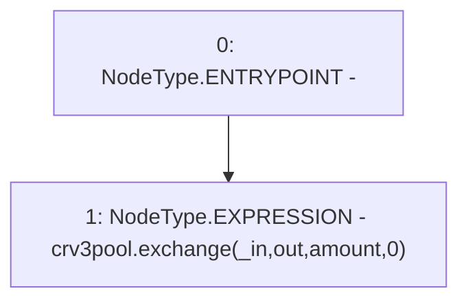

# Context: LifeGuard3Pool._exchange

**Contract:** `LifeGuard3Pool` (Inherits: FixedStablecoins, Constants, Whitelist, Controllable, Ownable, Context, ILifeGuard)
**Signature:** `_exchange(uint256,int128,int128) returns (uint256)`
**Method Selector ID:** `Internal (No Method ID)`
**Visibility:** `private`
**Environment-Free:** `Yes`
**Modifiers:** None

### State Variables Interaction
- **Reads:** crv3pool
- **Writes:** None

### Environment & Verification Flags
- **Uses Foundry Cheatcodes:** No
- **Has Echidna Properties:** No

### Internal Calls Tree
- None

### External Calls / Value Transfers
- `ICurve3Deposit.HIGH_LEVEL_CALL, dest:crv3pool(ICurve3Deposit), function:exchange, arguments:['_in', 'out', 'amount', '0']  `

### Control Flow Graph (CFG)


### Source Mapping
Declared in: `certora-ac-datasets/detasets/web3bugs/dataset/web3bugs/17/contracts/pools/LifeGuard3Pool.sol` on lines **369** to **375**

```solidity
    function _exchange(
        uint256 amount,
        int128 _in,
        int128 out
    ) private returns (uint256) {
        crv3pool.exchange(_in, out, amount, 0);
    }

```
