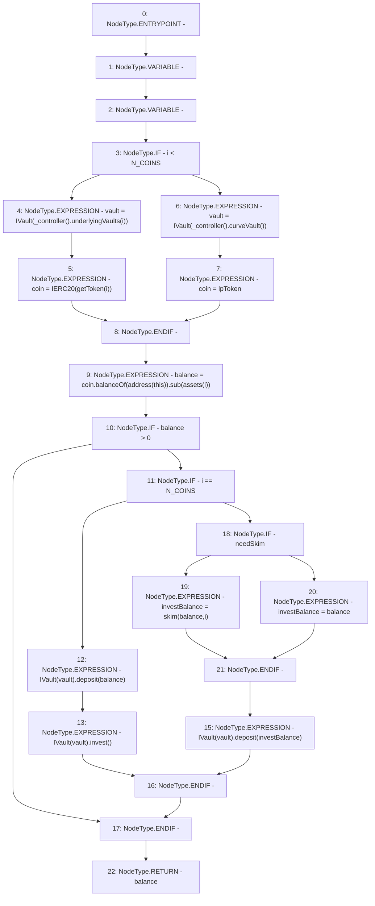

# Context: LifeGuard3Pool._investToVault

**Contract:** `LifeGuard3Pool` (Inherits: FixedStablecoins, Constants, Whitelist, Controllable, Ownable, Context, ILifeGuard)
**Signature:** `_investToVault(uint256,bool) returns (uint256)`
**Method Selector ID:** `Internal (No Method ID)`
**Visibility:** `private`
**Environment-Free:** `Yes`
**Modifiers:** None

### State Variables Interaction
- **Reads:** N_COINS, assets, lpToken
- **Writes:** None

### Environment & Verification Flags
- **Uses Foundry Cheatcodes:** No
- **Has Echidna Properties:** No

### Internal Calls Tree
- None

### External Calls / Value Transfers
- `IController.TMP_375(address) = HIGH_LEVEL_CALL, dest:TMP_374(IController), function:underlyingVaults, arguments:['i']  `
- `IController.TMP_380(address) = HIGH_LEVEL_CALL, dest:TMP_379(IController), function:curveVault, arguments:[]  `
- `SafeMath.TMP_384(uint256) = LIBRARY_CALL, dest:SafeMath, function:SafeMath.sub(uint256,uint256), arguments:['TMP_383', 'REF_146'] `
- `IERC20.TMP_383(uint256) = HIGH_LEVEL_CALL, dest:coin(IERC20), function:balanceOf, arguments:['TMP_382']  `
- `IVault.HIGH_LEVEL_CALL, dest:TMP_389(IVault), function:invest, arguments:[]  `
- `IVault.HIGH_LEVEL_CALL, dest:TMP_387(IVault), function:deposit, arguments:['balance']  `
- `IVault.HIGH_LEVEL_CALL, dest:TMP_391(IVault), function:deposit, arguments:['investBalance']  `

### Control Flow Graph (CFG)


### Source Mapping
Declared in: `certora-ac-datasets/detasets/web3bugs/dataset/web3bugs/17/contracts/pools/LifeGuard3Pool.sol` on lines **405** to **425**

```solidity
    function _investToVault(uint256 i, bool needSkim) private returns (uint256 balance) {
        IVault vault;
        IERC20 coin;
        if (i < N_COINS) {
            vault = IVault(_controller().underlyingVaults(i));
            coin = IERC20(getToken(i));
        } else {
            vault = IVault(_controller().curveVault());
            coin = lpToken;
        }
        balance = coin.balanceOf(address(this)).sub(assets[i]);
        if (balance > 0) {
            if (i == N_COINS) {
                IVault(vault).deposit(balance);
                IVault(vault).invest();
            } else {
                uint256 investBalance = needSkim ? skim(balance, i) : balance;
                IVault(vault).deposit(investBalance);
            }
        }
    }

```
