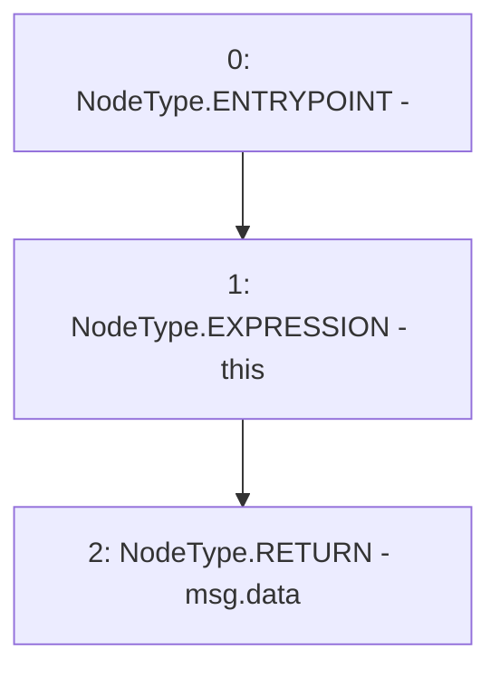

# Context: LifeGuard3Pool._msgData

**Contract:** `LifeGuard3Pool` (Inherits: FixedStablecoins, Constants, Whitelist, Controllable, Ownable, Context, ILifeGuard)
**Signature:** `_msgData() returns (bytes)`
**Method Selector ID:** `Internal (No Method ID)`
**Visibility:** `internal`
**Environment-Free:** `No (reads EVM state context)`
**Modifiers:** None

### State Variables Interaction
- **Reads:** None
- **Writes:** None

### Environment & Verification Flags
- **Uses Foundry Cheatcodes:** No
- **Has Echidna Properties:** No

### Internal Calls Tree
- None

### External Calls / Value Transfers
- None

### Control Flow Graph (CFG)


### Source Mapping
Declared in: `certora-ac-datasets/detasets/web3bugs/dataset/web3bugs/17/node_modules/@openzeppelin/contracts/utils/Context.sol` on lines **20** to **23**

```solidity
    function _msgData() internal view virtual returns (bytes memory) {
        this; // silence state mutability warning without generating bytecode - see https://github.com/ethereum/solidity/issues/2691
        return msg.data;
    }

```
