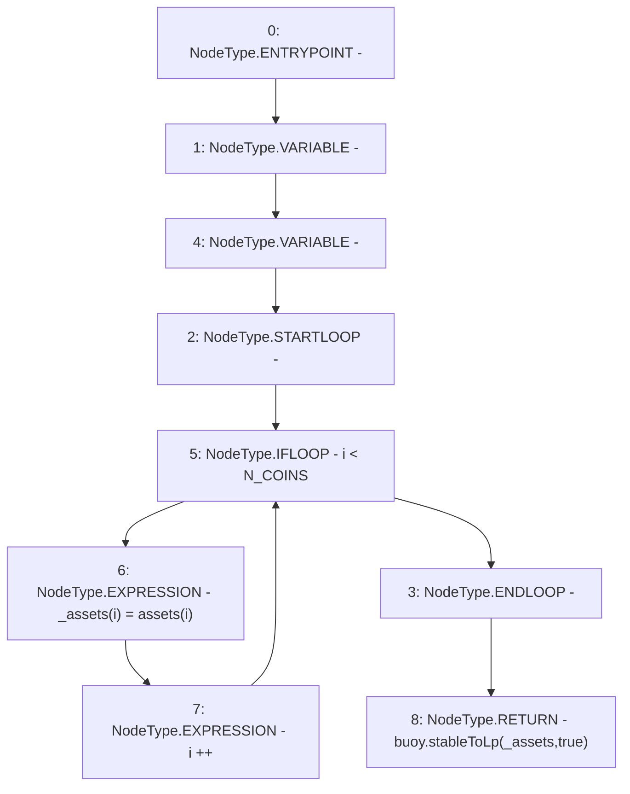

# Context: LifeGuard3Pool._totalAssets

**Contract:** `LifeGuard3Pool` (Inherits: FixedStablecoins, Constants, Whitelist, Controllable, Ownable, Context, ILifeGuard)
**Signature:** `_totalAssets() returns (uint256)`
**Method Selector ID:** `Internal (No Method ID)`
**Visibility:** `private`
**Environment-Free:** `Yes`
**Modifiers:** None

### State Variables Interaction
- **Reads:** N_COINS, assets, buoy
- **Writes:** None

### Environment & Verification Flags
- **Uses Foundry Cheatcodes:** No
- **Has Echidna Properties:** No

### Internal Calls Tree
- None

### External Calls / Value Transfers
- `IBuoy.TMP_372(uint256) = HIGH_LEVEL_CALL, dest:buoy(IBuoy), function:stableToLp, arguments:['_assets', 'True']  `

### Control Flow Graph (CFG)


### Source Mapping
Declared in: `certora-ac-datasets/detasets/web3bugs/dataset/web3bugs/17/contracts/pools/LifeGuard3Pool.sol` on lines **394** to **400**

```solidity
    function _totalAssets() private view returns (uint256) {
        uint256[N_COINS] memory _assets;
        for (uint256 i; i < N_COINS; i++) {
            _assets[i] = assets[i];
        }
        return buoy.stableToLp(_assets, true);
    }

```
