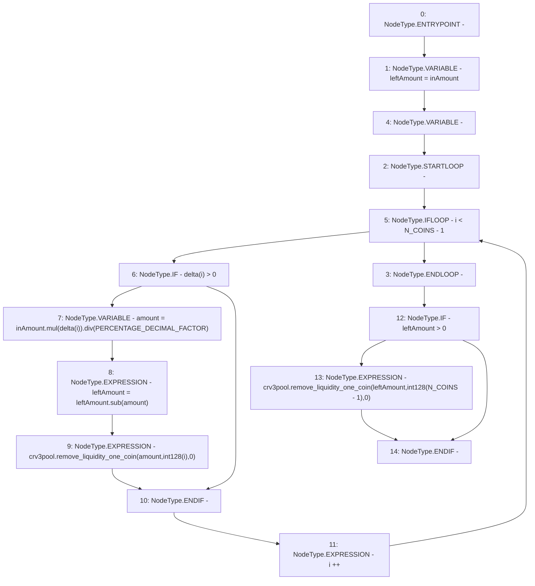

# Context: LifeGuard3Pool._withdrawUnbalanced

**Contract:** `LifeGuard3Pool` (Inherits: FixedStablecoins, Constants, Whitelist, Controllable, Ownable, Context, ILifeGuard)
**Signature:** `_withdrawUnbalanced(uint256,uint256[3])`
**Method Selector ID:** `Internal (No Method ID)`
**Visibility:** `private`
**Environment-Free:** `Yes`
**Modifiers:** None

### State Variables Interaction
- **Reads:** N_COINS, PERCENTAGE_DECIMAL_FACTOR, crv3pool
- **Writes:** None

### Environment & Verification Flags
- **Uses Foundry Cheatcodes:** No
- **Has Echidna Properties:** No

### Internal Calls Tree
- None

### External Calls / Value Transfers
- `SafeMath.TMP_361(uint256) = LIBRARY_CALL, dest:SafeMath, function:SafeMath.div(uint256,uint256), arguments:['TMP_360', 'PERCENTAGE_DECIMAL_FACTOR'] `
- `SafeMath.TMP_362(uint256) = LIBRARY_CALL, dest:SafeMath, function:SafeMath.sub(uint256,uint256), arguments:['leftAmount', 'amount'] `
- `ICurve3Deposit.HIGH_LEVEL_CALL, dest:crv3pool(ICurve3Deposit), function:remove_liquidity_one_coin, arguments:['amount', 'TMP_363', '0']  `
- `ICurve3Deposit.HIGH_LEVEL_CALL, dest:crv3pool(ICurve3Deposit), function:remove_liquidity_one_coin, arguments:['leftAmount', 'TMP_368', '0']  `
- `SafeMath.TMP_360(uint256) = LIBRARY_CALL, dest:SafeMath, function:SafeMath.mul(uint256,uint256), arguments:['inAmount', 'REF_134'] `

### Control Flow Graph (CFG)


### Source Mapping
Declared in: `certora-ac-datasets/detasets/web3bugs/dataset/web3bugs/17/contracts/pools/LifeGuard3Pool.sol` on lines **380** to **392**

```solidity
    function _withdrawUnbalanced(uint256 inAmount, uint256[N_COINS] memory delta) private {
        uint256 leftAmount = inAmount;
        for (uint256 i; i < N_COINS - 1; i++) {
            if (delta[i] > 0) {
                uint256 amount = inAmount.mul(delta[i]).div(PERCENTAGE_DECIMAL_FACTOR);
                leftAmount = leftAmount.sub(amount);
                crv3pool.remove_liquidity_one_coin(amount, int128(i), 0);
            }
        }
        if (leftAmount > 0) {
            crv3pool.remove_liquidity_one_coin(leftAmount, int128(N_COINS - 1), 0);
        }
    }

```
