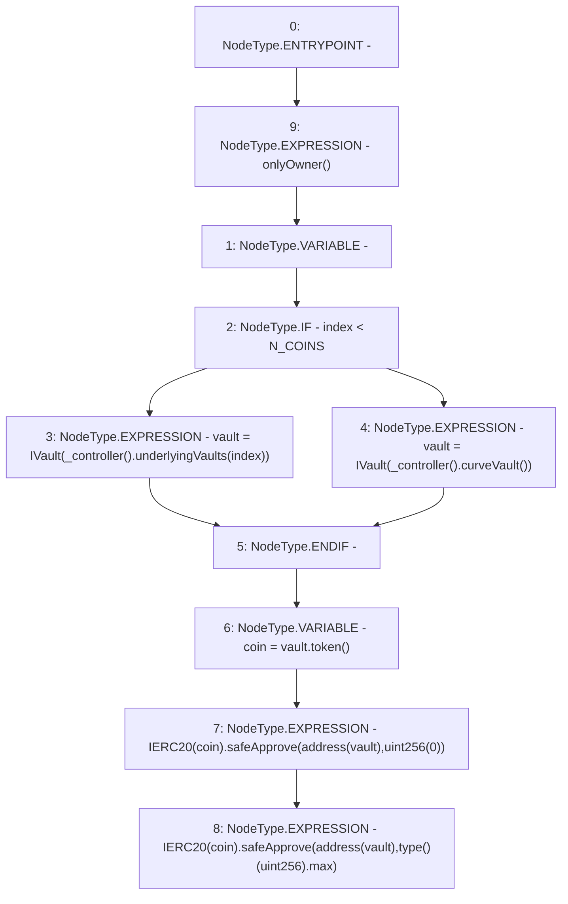

# Context: LifeGuard3Pool.approveVaults

**Contract:** `LifeGuard3Pool` (Inherits: FixedStablecoins, Constants, Whitelist, Controllable, Ownable, Context, ILifeGuard)
**Signature:** `approveVaults(uint256)`
**Method Selector ID:** `0x32bd7987`
**Visibility:** `external`
**Environment-Free:** `No (reads EVM state context)`
**Modifiers:**
- `onlyOwner`
  ```solidity
  modifier onlyOwner() {
          require(owner() == _msgSender(), "Ownable: caller is not the owner");
          _;
      }
  ```

### State Variables Interaction
- **Reads:** N_COINS
- **Writes:** None

### Environment & Verification Flags
- **Uses Foundry Cheatcodes:** No
- **Has Echidna Properties:** No

### Internal Calls Tree
- None

### External Calls / Value Transfers
- `IVault.TMP_180(address) = HIGH_LEVEL_CALL, dest:vault(IVault), function:token, arguments:[]  `
- `SafeERC20.LIBRARY_CALL, dest:SafeERC20, function:SafeERC20.safeApprove(IERC20,address,uint256), arguments:['TMP_181', 'TMP_182', 'TMP_183'] `
- `IController.TMP_175(address) = HIGH_LEVEL_CALL, dest:TMP_174(IController), function:underlyingVaults, arguments:['index']  `
- `IController.TMP_178(address) = HIGH_LEVEL_CALL, dest:TMP_177(IController), function:curveVault, arguments:[]  `
- `SafeERC20.LIBRARY_CALL, dest:SafeERC20, function:SafeERC20.safeApprove(IERC20,address,uint256), arguments:['TMP_185', 'TMP_186', 'TMP_188'] `

### Control Flow Graph (CFG)


### Source Mapping
Declared in: `certora-ac-datasets/detasets/web3bugs/dataset/web3bugs/17/contracts/pools/LifeGuard3Pool.sol` on lines **102** to **112**

```solidity
    function approveVaults(uint256 index) external onlyOwner {
        IVault vault;
        if (index < N_COINS) {
            vault = IVault(_controller().underlyingVaults(index));
        } else {
            vault = IVault(_controller().curveVault());
        }
        address coin = vault.token();
        IERC20(coin).safeApprove(address(vault), uint256(0));
        IERC20(coin).safeApprove(address(vault), type(uint256).max);
    }

```
