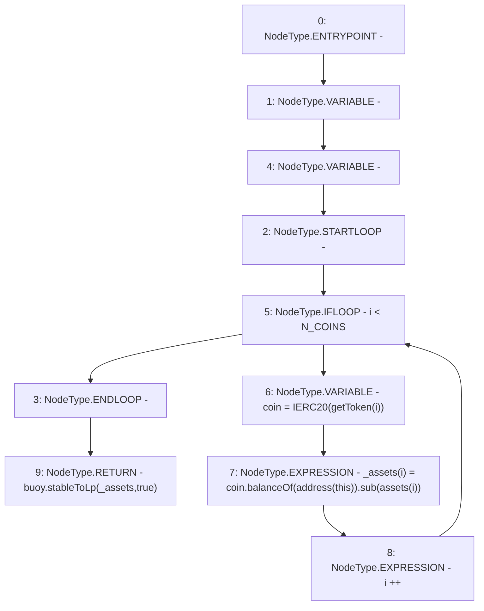

# Context: LifeGuard3Pool.availableLP

**Contract:** `LifeGuard3Pool` (Inherits: FixedStablecoins, Constants, Whitelist, Controllable, Ownable, Context, ILifeGuard)
**Signature:** `availableLP() returns (uint256)`
**Method Selector ID:** `0xb9ec4843`
**Visibility:** `external`
**Environment-Free:** `Yes`
**Modifiers:** None

### State Variables Interaction
- **Reads:** N_COINS, assets, buoy
- **Writes:** None

### Environment & Verification Flags
- **Uses Foundry Cheatcodes:** No
- **Has Echidna Properties:** No

### Internal Calls Tree
- None

### External Calls / Value Transfers
- `IBuoy.TMP_345(uint256) = HIGH_LEVEL_CALL, dest:buoy(IBuoy), function:stableToLp, arguments:['_assets', 'True']  `
- `IERC20.TMP_342(uint256) = HIGH_LEVEL_CALL, dest:coin(IERC20), function:balanceOf, arguments:['TMP_341']  `
- `SafeMath.TMP_343(uint256) = LIBRARY_CALL, dest:SafeMath, function:SafeMath.sub(uint256,uint256), arguments:['TMP_342', 'REF_122'] `

### Control Flow Graph (CFG)


### Source Mapping
Declared in: `certora-ac-datasets/detasets/web3bugs/dataset/web3bugs/17/contracts/pools/LifeGuard3Pool.sol` on lines **342** to **349**

```solidity
    function availableLP() external view override returns (uint256) {
        uint256[N_COINS] memory _assets;
        for (uint256 i; i < N_COINS; i++) {
            IERC20 coin = IERC20(getToken(i));
            _assets[i] = coin.balanceOf(address(this)).sub(assets[i]);
        }
        return buoy.stableToLp(_assets, true);
    }

```
